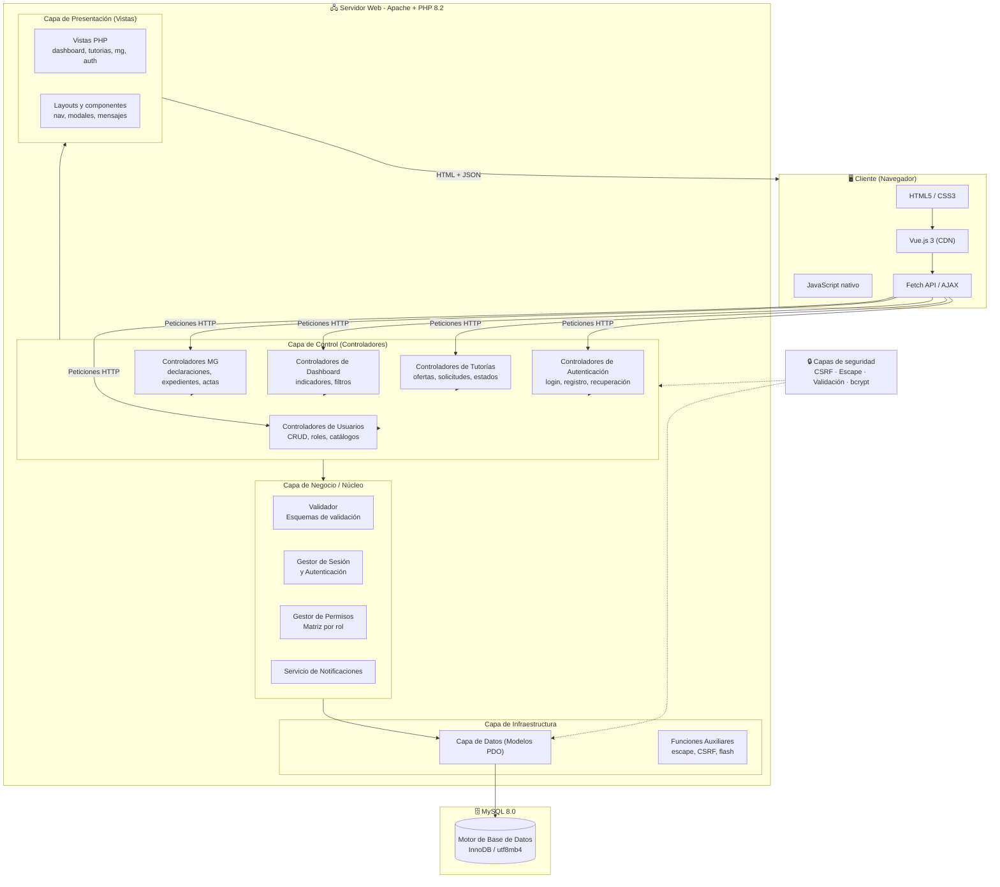
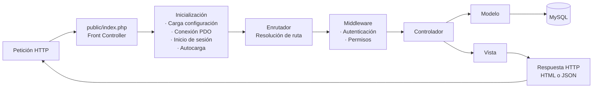
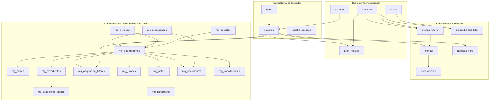
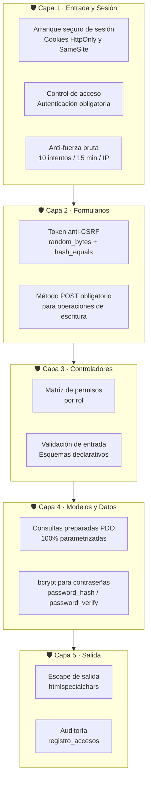
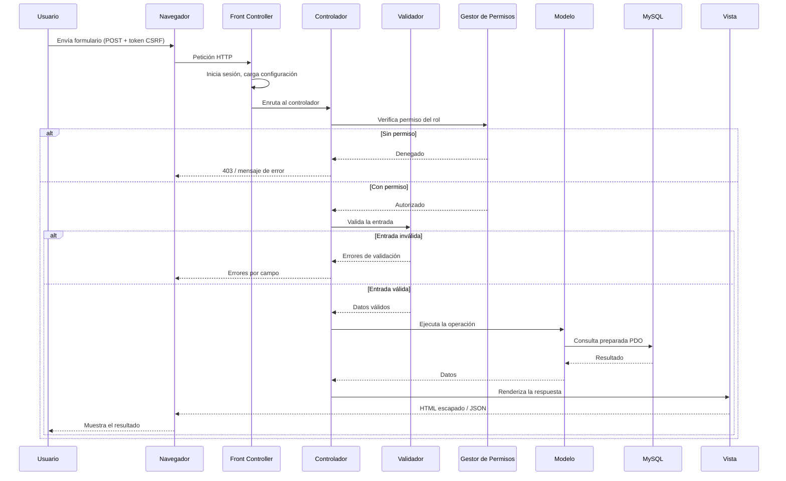
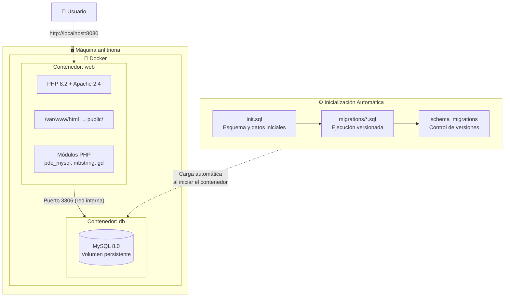

# Arquitectura del Sistema
## Sistema de Tutorías y Modalidades de Grado

**Documento de Arquitectura de Software**
**Versión:** 1.0

---

## 1. Introducción

Este documento describe la arquitectura del **Sistema de Tutorías y Modalidades de
Grado**. La arquitectura define la estructura técnica del sistema: sus capas, sus
componentes, sus responsabilidades y las relaciones entre ellos.

El sistema fue diseñado siguiendo el patrón de arquitectura **Modelo-Vista-Controlador
(MVC)**, implementado de forma nativa en PHP sin el uso de frameworks externos. Esta
decisión responde a las restricciones del proyecto, que exigen demostrar el
dominio de los fundamentos del desarrollo web en PHP.

---

## 2. Principios arquitectónicos

| Principio | Descripción |
|---|---|
| **Separación de responsabilidades** | Cada capa tiene una función específica y no invaden las competencias de las demás. |
| **Bajo acoplamiento** | Las capas se comunican mediante interfaces simples (Modelos, Vistas, Controladores). |
| **Alta cohesión** | Cada componente agrupa functionalities relacionadas. |
| **Reutilización** | La lógica común se centraliza en funciones auxiliares reutilizables. |
| **Seguridad por diseño** | La validación y el escape se aplican de forma sistemática en todas las capas. |
| **Portabilidad** | El sistema se despliega íntegramente mediante contenedores Docker. |

---

## 3. Vista general de la arquitectura

### 3.1 Diagrama de arquitectura



### 3.2 Descripción de las capas

| Capa | Ubicación | Responsabilidad |
|---|---|---|
| **Cliente** | Navegador del usuario | Presentar la interfaz, capturar la entrada del usuario e interactuar mediante AJAX. |
| **Vistas** | `views/` | Generar el HTML que se envía al cliente. No contienen lógica de negocio. |
| **Controladores** | `controllers/` | Atender las peticiones HTTP, coordinar el flujo y delegar en los modelos. |
| **Negocio** | `includes/`, `helpers/` | Aplicar validación, autenticación, permisos y lógica transversal. |
| **Modelos** | `models/` | Ejecutar consultas SQL parametrizadas y mapear resultados. |
| **Datos** | MySQL 8.0 | Persistir la información y garantizar la integridad referencial. |

---

## 4. Estructura de directorios

```text
TecnologiaWebProyecto/
├── config/
│   ├── config.php              # Constantes y rutas del proyecto
│   └── database.php            # Parámetros de conexión ( variables de entorno)
│
├── controllers/                # Capa de Control
│   ├── auth/                   # Autenticación y registro
│   ├── dashboard/              # Indicadores y reportes
│   ├── tutorias/               # Ofertas, solicitudes, estados
│   ├── mg/                     # Modalidades de grado
│   ├── admin/                  # Usuarios y catálogos
│   └── ajax/                   # Peticiones asíncronas
│
├── models/                     # Capa de Modelo
│   ├── UsuarioModel.php
│   ├── TutorModel.php
│   ├── EstudianteModel.php
│   ├── TutoriaModel.php
│   ├── OfertaModel.php
│   ├── DashboardModel.php
│   └── mg/                     # Modelos del módulo MG
│
├── views/                      # Capa de Presentación
│   ├── layouts/                # Plantillas base
│   ├── partials/               # Componentes reutilizables
│   ├── auth/                   # Vistas de acceso
│   ├── dashboard/              # Vistas del panel
│   ├── tutorias/               # Vistas de tutorías
│   ├── mg/                     # Vistas de modalidades
│   └── admin/                  # Vistas administrativas
│
├── includes/                   # Capa de Infraestructura y Núcleo
│   ├── config.php
│   ├── database.php            # Clase de conexión PDO
│   ├── funciones.php           # Utilidades (escape, CSRF, sesión, flash)
│   ├── permisos.php            # Matriz de permisos por rol
│   ├── auth.php                # Guardas de autenticación
│   └── validador.php           # API de validación
│
├── public/                     # Raíz web (document root)
│   ├── index.php               # Front controller
│   ├── assets/
│   │   ├── css/
│   │   ├── js/
│   │   └── img/
│   └── uploads/                # Documentos adjuntos
│
├── database/
│   ├── init.sql                # Esquema base y datos iniciales
│   └── migrations/             # Migraciones versionadas
│
├── docs/                       # Documentación técnica
├── tests/                      # Pruebas
├── docker-compose.yml
├── Dockerfile
└── README.md
```

---

## 5. Patrón Modelo-Vista-Controlador

### 5.1 Modelo

Los modelos encapsulan el acceso a la base de datos. Cada modelo corresponde a una
entidad o a un conjunto de entidades y expone métodos que devuelven arrays asociativos.

```php
// Patrón general de un modelo
class TutoriaModel {
    private $db;

    public function __construct(PDO $db) {
        $this->db = $db;
    }

    public function buscarPorId($id) {
        $sql = "SELECT * FROM tutorias WHERE id = ?";
        $stmt = $this->db->prepare($sql);
        $stmt->execute([$id]);
        return $stmt->fetch(PDO::FETCH_ASSOC);
    }
}
```

**Características**
- Solo usan **consultas preparadas PDO**, lo que elimina la inyección SQL.
- No contienen lógica de presentación ni salidas HTML.
- Se pueden probar de forma aislada.

### 5.2 Controlador

Los controladores atienden las peticiones, validan la entrada del usuario y coordinan
el flujo entre modelos y vistas.

```php
// Patrón general de un controlador
class TutoriasController {
    private $modelo;

    public function __construct() {
        $this->modelo = new TutoriaModel(db());
    }

    public function listar() {
        verificarPermiso('ver_tutorias');
        $tutorias = $this->modelo->listarTodas();
        require VIEWS_PATH . '/tutorias/index.php';
    }
}
```

**Características**
- Verifican el token CSRF en las operaciones de escritura.
- Aplican la matriz de permisos antes de ejecutar la acción.
- Devuelven respuestas HTML o JSON según el tipo de petición.

### 5.3 Vista

Las vistas generan el HTML que se envía al navegador. Aplican escape a toda salida
dinámica para prevenir ataques XSS.

```php
<!-- Patrón general de una vista -->
<h2><?= e($titulo) ?></h2>
<?php foreach ($tutorias as $t): ?>
    <tr>
        <td><?= e($t['materia']) ?></td>
        <td><?= e($t['fecha']) ?></td>
    </tr>
<?php endforeach; ?>
```

---

## 6. Patrón Front Controller

Todo el tráfico HTTP se dirige a un único punto de entrada: `public/index.php`. Este
mecanismo centraliza el arranque de la aplicación.



**Ventajas del patrón**
- Punto único de control sobre la seguridad y el flujo de la aplicación.
- Evita la exposición de archivos sensibles del directorio del proyecto.
- Simplifica la incorporación de middlewares transversales.

---

## 7. Modelo de datos a nivel de arquitectura



---

## 8. Arquitectura de la base de datos

### 8.1 Esquema general

La base de datos se organiza en cuatro dominios funcionales claramente delimitados:

| Dominio | Tablas principales | Responsabilidad |
|---|---|---|
| **Identidad** | `usuarios`, `roles`, `registro_accesos`, `notificaciones` | Identificación, sesión y auditoría de accesos. |
| **Institucional** | `carreras`, `materias`, `turnos`, `tutor_materia` | Estructura académica de la institución. |
| **Tutorías** | `ofertas_tutoria`, `disponibilidad_tutor`, `tutorias`, `evaluaciones` | Ciclo completo de la tutoría. |
| **Modalidades de Grado** | `mg_modalidades`, `mg_declaraciones`, `mg_expedientes`, `mg_actas`, entre otras | Proceso de modalidades de grado. |

### 8.2 Motor de almacenamiento

| Característica | Configuración |
|---|---|
| **Motor** | InnoDB |
| **Codificación** | `utf8mb4_unicode_ci` |
| **Integridad referencial** | Claves foráneas con `ON DELETE` y `ON UPDATE` definidos |
| **Restricciones de dominio** | Campos `ENUM` para estados controlados |
| **Claves compuestas** | Restricciones `UNIQUE` en combinaciones de negocio |
| **Migraciones** | Archivos versionados con registro en `schema_migrations` |

### 8.3 Estrategia de indices

| Índice | Propósito |
|---|---|
| `idx_*_fecha` | Acelera los filtros cronológicos del dashboard y los reportes. |
| `idx_*_estado` | Optimiza la consulta de registros por estado. |
| `idx_tutorias_tutor` | Acelera el acceso del tutor a sus registros. |
| `idx_tutorias_estudiante` | Acelera el acceso del estudiante a sus registros. |
| `UNIQUE` compuestos | Impiden duplicados en catálogos y combinaciones de negocio. |

---

## 9. Arquitectura de seguridad



Los detalles completos de estas medidas se encuentran en
[`Seguridad.md`](Seguridad.md).

---

## 10. Patrón de flujo de una petición



---

## 11. Arquitectura de despliegue



### 11.1 Componentes de despliegue

| Componente | Tecnología | Función |
|---|---|---|
| **Servidor web** | Apache 2.4 | Publica el punto de entrada y reescribe las URL. |
| **Lenguaje** | PHP 8.2 | Ejecuta la lógica de la aplicación. |
| **Base de datos** | MySQL 8.0 | Almacena y relaciona la información. |
| **Orquestación** | Docker Compose | Levanta y conecta los servicios. |
| **Volumen de datos** | Volumen nombrado | Persiste la base de datos entre reinicios. |

### 11.2 Variables de entorno

La configuración se externaliza del código mediante variables de entorno:

| Variable | Descripción |
|---|---|
| `DB_HOST` | Servidor de la base de datos. |
| `DB_PORT` | Puerto de conexión. |
| `DB_NAME` | Nombre de la base de datos. |
| `DB_USER` | Usuario de conexión. |
| `DB_PASS` | Contraseña de conexión. |
| `APP_DEBUG` | Modo de depuración. |
| `DB_PERSISTENT` | Habilita conexiones persistentes. |

---

## 12. Decisiones arquitectónicas

| # | Decisión | Justificación |
|---|---|---|
| 1 | **MVC nativo en PHP** | Cumplir la restricción de no usar frameworks y evidenciar dominio de los fundamentos. |
| 2 | **Front controller único** | Centralizar la seguridad y evitar la exposición de archivos internos. |
| 3 | **PDO con consultas preparadas** | Eliminar la inyección SQL de forma estructural, no por disciplina del programador. |
| 4 | **Vue.js por CDN** | Interactividad sin proceso de compilación, reduciendo la complejidad del despliegue. |
| 5 | **Migraciones versionadas** | Permitir la evolución del esquema de forma reproducible y auditable. |
| 6 | **Parámetros en base de datos** | Evitar la modificación de reglas de negocio en el código fuente. |
| 7 | **Campos ENUM para estados** | Aplicar las restricciones de dominio directamente en el motor de base de datos. |
| 8 | **Docker Compose** | Garantizar un despliegue reproducible e independiente del sistema operativo. |
| 9 | **Tabla de historial de asignaciones** | Preservar la trazabilidad sin eliminar registros previos. |
| 10 | **Instantáneas de documentos** | Conservar el contenido emitido aunque la plantilla cambie posteriormente. |

---

## 13. Vista de privilegios por rol

| Componente | Administrador | Tutor | Estudiante | Coordinador MG | Auxiliar MG |
|---|---|---|---|---|---|
| **Dashboard institucional** | Acceso total | — | — | — | — |
| **Gestión de usuarios** | Acceso total | — | — | — | — |
| **Gestión de catálogos** | Acceso total | — | — | — | — |
| **Crear ofertas** | Acceso | — | — | — | — |
| **Aceptar ofertas** | — | Acceso | — | — | — |
| **Configurar disponibilidad** | — | Acceso | — | — | — |
| **Solicitar tutoría** | — | — | Acceso | — | — |
| **Evaluar tutoría** | — | — | Acceso | — | — |
| **Gestionar estados** | Acceso | Solo propias | Solo cancelación | — | — |
| **Registrar modalidad** | Acceso | — | — | Acceso | — |
| **Declarar modalidad** | — | — | Acceso | — | — |
| **Gestionar avales** | Acceso | — | — | Acceso | Acceso |
| **Aprobar / rechazar** | Acceso | — | — | Acceso | — |
| **Importar padrón** | Acceso | — | — | Acceso | Acceso |
| **Asignar tutor de grado** | Acceso | — | — | Acceso | — |
| **Registrar etapas** | Acceso | — | — | Acceso | Acceso |
| **Asignar jurado** | Acceso | — | — | Acceso | Acceso |
| **Registrar acta** | Acceso | — | — | Acceso | Acceso |
| **Generar documentos** | Acceso | — | — | Acceso | Acceso |
| **Configurar parámetros** | Acceso | — | — | Acceso | — |

---

## 14. Conclusiones de la arquitectura

La arquitectura adoptada permite que el sistema sea **modular, seguro y mantenible**,
garantizando la separación clara entre la lógica de negocio, la presentación y el
acceso a los datos. La aplicación del patrón MVC junto con un front controller único
y una capa de datos basada en consultas preparadas proporciona una base sólida sobre
la cual se construyeron los dos módulos funcionales del sistema.

La decisión de utilizar la arquitectura MVC nativa, sin frameworks externos, favoreció
un mayor comprensión de los mecanismos internos del desarrollo web en PHP, y la
adopción de contenedores garantiza un despliegue reproducible en cualquier entorno.

---

*Fin del documento de Arquitectura*
