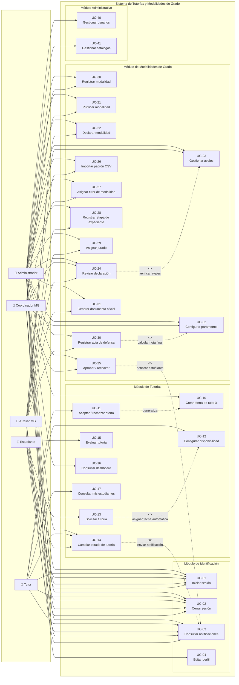

# Casos de Uso
## Sistema de Tutorías y Modalidades de Grado

**Especificación de Casos de Uso**
**Versión:** 1.0

---

## 1. Introducción

Este documento especifica los casos de uso del **Sistema de Tutorías y Modalidades
de Grado**. Un caso de uso describe una interacción completa entre un actor externo
y el sistema para lograr un objetivo concreto.

La especificación sigue la notación estándar de la ingeniería de requisitos: cada
caso se identifica con un código, un nombre, el actor principal, los actores
secundarios, la precondición, la postcondición, el flujo principal, los flujos
alternos y las reglas de negocio asociadas.

---

## 2. Actores del sistema

### 2.1 Actores principales

| Actor | Tipo | Descripción |
|---|---|---|
| **Administrador** | Persona | Gestiona usuarios, catálogos, ofertas, tutorías y la configuración general del sistema. |
| **Tutor** | Persona | Imparte tutorías, administra su disponibilidad y ejecuta el seguimiento de sus sesiones. |
| **Estudiante** | Persona | Solicita tutorías, las evalúa y declara su modalidad de grado. |
| **Coordinador MG** | Persona | Coordina el proceso de modalidades de grado: catálogo, periodos, revisión y aprobación. |
| **Auxiliar MG** | Persona | Ejecuta la operación diaria: avales, importaciones, expedientes, tribunal y actas. |

### 2.2 Actores secundarios

| Actor | Tipo | Descripción |
|---|---|---|
| **Sistema de base de datos** | Sistema | MySQL 8, persistencia y garantía de integridad referencial. |
| **Correo/Sistema externo** | Sistema | No implementado en la versión actual (ver Limitaciones). |

### 2.3 Diagrama de casos de uso

---

## 3. Especificación de los casos de uso

---

### UC-01: Iniciar sesión

| Campo | Descripción |
|---|---|
| **Código** | UC-01 |
| **Nombre** | Iniciar sesión |
| **Actor principal** | Administrador, Tutor, Estudiante, Coordinador MG, Auxiliar MG |
| **Actores secundarios** | Sistema de base de datos |
| **Precondición** | El usuario cuenta con credenciales válidas y activas. |
| **Postcondición** | Se crea una sesión autenticada con el rol asignado; se registra el acceso. |
| **Prioridad** | Alta |

**Reglas de negocio**
- RN-01: La contraseña se verifica mediante `password_verify()` contra un hash bcrypt.
- RN-02: Se admiten como identificador tanto el nombre de usuario como el correo.
- RN-03: Las cuentas en estado *inactivo* no pueden autenticarse.
- RN-04: El sistema bloquea el ingreso tras 10 intentos fallidos por IP en 15 minutos.
- RN-05: Tras autenticarse, se regenera el identificador de sesión.
- RN-06: El mensaje de error es genérico; no revela si la falla fue el usuario o la contraseña.
- RN-07: La redirección posterior depende del rol del usuario.

**Flujo principal**

| # | Actor | Sistema |
|---|---|---|
| 1 | Ingresa usuario/correo y contraseña. | — |
| 2 | — | Verifica el token CSRF del formulario. |
| 3 | — | Comprueba el límite de intentos fallidos por IP. |
| 4 | — | Busca la cuenta por usuario o correo. |
| 5 | — | Verifica el estado de la cuenta y la contraseña. |
| 6 | — | Genera un nuevo ID de sesión y guarda los datos del usuario. |
| 7 | — | Registra el acceso exitoso (usuario, IP, fecha). |
| 8 | — | Redirige al panel correspondiente según el rol. |

**Flujos alternos**

| # | Condición | Resultado |
|---|---|---|
| A1 | Token CSRF inválido | Muestra "La solicitud expiró"; vuelve al login. |
| A2 | Se superan los 10 intentos | Bloquea por 15 minutos con mensaje explicativo. |
| A3 | La cuenta no existe | Muestra mensaje genérico de credenciales incorrectas. |
| A4 | La contraseña es incorrecta | Muestra mensaje genérico; registra el intento fallido. |
| A5 | La cuenta está inactiva | Muestra mensaje genérico. |
| A6 | El rol es desconocido | Redirige al login. |

---

### UC-02: Cerrar sesión

| Campo | Descripción |
|---|---|
| **Actor principal** | Cualquier usuario autenticado |
| **Precondición** | Existe una sesión activa. |
| **Postcondición** | La sesión se destruye; el usuario vuelve al login. |
| **Prioridad** | Alta |

**Flujo principal**
1. El usuario selecciona *Cerrar sesión* en el menú de usuario.
2. El sistema destruye la sesión y redirige al login.

---

### UC-03: Consultar notificaciones

| Campo | Descripción |
|---|---|
| **Actor principal** | Cualquier usuario autenticado |
| **Actores secundarios** | Sistema de base de datos |
| **Precondición** | El usuario ha iniciado sesión. |
| **Postcondición** | Se muestran las notificaciones; las leídas se marcan como tal. |

**Reglas de negocio**
- RN-08: Las notificaciones se generan automáticamente ante cambios de estado de
  tutoría y de declaración.
- RN-09: El sistema no permite duplicar una notificación para el mismo destinatario
  y evento.

**Flujo principal**
1. El usuario pulsa el ícono de notificaciones (con contador de no leídas).
2. El sistema lista las notificaciones ordenadas por fecha descendente.
3. El usuario marca una o varias como leídas.
4. El sistema actualiza el estado y descuenta el contador.

---

### UC-04: Editar perfil

| Campo | Descripción |
|---|---|
| **Actor principal** | Cualquier usuario autenticado |
| **Precondición** | El usuario ha iniciado sesión. |
| **Postcondición** | Los datos del perfil quedan actualizados. |

**Reglas de negocio**
- RN-10: El usuario puede modificar sus datos de contacto, pero no su rol ni su
  estado.
- RN-11: La carga de fotografía de perfil acepta imágenes y valida el tamaño.

---

### UC-10: Crear oferta de tutoría

| Campo | Descripción |
|---|---|
| **Actor principal** | Administrador |
| **Actores secundarios** | Sistema de base de datos |
| **Precondición** | El usuario ha iniciado sesión con rol administrador. |
| **Postcondición** | La oferta queda registrada en estado *abierta* y visible para los tutores. |
| **Prioridad** | Alta |

**Reglas de negocio**
- RN-12: Una oferta se define por la combinación materia + nivel académico + turno.
- RN-13: El nivel académico admite valores pregrado, posgrado, invierno, verano o
  texto personalizado.
- RN-14: La modalidad presencial exige un lugar; la virtual exige un enlace válido.
- RN-15: No se admiten ofertas duplicadas para la misma combinación.

**Flujo principal**
1. El administrador accede a *Ofertas → Crear*.
2. Selecciona la materia, el nivel académico y el turno.
3. Define la modalidad y el lugar o enlace.
4. Guarda la oferta.
5. El sistema valida los datos y la registra en estado *abierta*.
6. El sistema notifica a los tutores de la materia.

**Flujos alternos**

| # | Condición | Resultado |
|---|---|---|
| A1 | Falta un campo obligatorio | Muestra el error del campo correspondiente. |
| A2 | El enlace no es una URL válida | Rechaza y solicita corregir. |
| A3 | Ya existe la combinación | Rechaza por duplicidad. |

---

### UC-11: Aceptar o rechazar oferta

| Campo | Descripción |
|---|---|
| **Actor principal** | Tutor |
| **Actores secundarios** | Sistema de base de datos |
| **Precondición** | El tutor ha iniciado sesión y existe al menos una oferta abierta para una de sus materias. |
| **Postcondición** | La oferta queda asignada al tutor o descartada. |
| **Prioridad** | Alta |

**Reglas de negocio**
- RN-16: Solo el tutor puede aceptar ofertas de las materias que imparte.
- RN-17: Al aceptar, la oferta pasa a estado *asignada* y se le asigna el tutor.
- RN-18: Un tutor no puede tomar dos ofertas del mismo turno.

**Flujo principal**
1. El tutor accede al módulo *Ofertas*.
2. Visualiza las ofertas de sus materias.
3. Pulsa *Aceptar* o *Rechazar*.
4. El sistema actualiza el estado de la oferta.
5. El sistema notifica al administrador.

---

### UC-12: Configurar disponibilidad del tutor

| Campo | Descripción |
|---|---|
| **Actor principal** | Tutor |
| **Precondición** | El tutor ha iniciado sesión. |
| **Postcondición** | La combinación (materia, turno) queda registrada como disponible. |

**Reglas de negocio**
- RN-19: La disponibilidad se define por materia y turno.
- RN-20: No se permiten duplicados de la combinación.

---

### UC-13: Solicitar tutoría

| Campo | Descripción |
|---|---|
| **Actor principal** | Estudiante |
| **Actores secundarios** | Sistema de base de datos |
| **Precondición** | El estudiante ha iniciado sesión y existe al menos una oferta asignada para una materia de su carrera. |
| **Postcondición** | Se crea la tutoría en estado *pendiente* con fecha asignada automáticamente. |
| **Prioridad** | Alta |

**Reglas de negocio**
- RN-21: El estudiante solo puede solicitar sobre materias de su propia carrera.
- RN-22: La oferta debe estar en estado *asignada* y tener tutor.
- RN-23: Un estudiante no puede tener dos solicitudes activas para la misma materia.
- RN-24: La fecha se asigna automáticamente: el primer día libre del turno, sin
  conflictos de agenda del tutor ni del estudiante.
- RN-25: La modalidad, el lugar/enlace, el nivel académico y el turno se heredan de
  la oferta.
- RN-26: Las observaciones tienen un límite de 1000 caracteres.

**Flujo principal**
1. El estudiante pulsa *Solicitar tutoría* desde su panel.
2. El sistema muestra únicamente las ofertas disponibles para las materias de su
   carrera.
3. El estudiante selecciona un horario y, opcionalmente, escribe observaciones.
4. Envía la solicitud.
5. El sistema valida: existencia de la oferta, estado *asignada*, pertenencia a su
   carrera, ausencia de duplicados y disponibilidad de fecha.
6. El sistema calcula la fecha del primer día libre del turno.
7. El sistema inserta la tutoría en estado *pendiente*.
8. El sistema notifica al tutor.

**Flujos alternos**

| # | Condición | Resultado |
|---|---|---|
| A1 | No se selecciona oferta | Muestra "Debes seleccionar un horario disponible". |
| A2 | La oferta ya no está asignada | Muestra "Ese horario ya no está disponible". |
| A3 | La materia no pertenece a su carrera | Rechaza la solicitud. |
| A4 | Ya existe una solicitud para la materia | Rechaza e informa del requisito de cancelar la anterior. |
| A5 | No hay fechas disponibles en 6 meses | Muestra aviso y sugiere otro turno. |
| A6 | Las observaciones superan 1000 caracteres | Muestra el error de longitud. |

---

### UC-14: Cambiar estado de tutoría

| Campo | Descripción |
|---|---|
| **Actor principal** | Administrador, Tutor, Estudiante |
| **Actores secundarios** | Sistema de base de datos |
| **Precondición** | El usuario ha iniciado sesión y la tutoría existe. |
| **Postcondición** | El estado de la tutoría se actualiza y se notifica a los implicados. |
| **Prioridad** | Alta |

**Reglas de negocio**
- RN-27: El ciclo de estados es: `pendiente → confirmada → en_proceso → realizada`,
  con `cancelada` como estado terminal alternativo.
- RN-28: El administrador puede realizar cualquier transición.
- RN-29: El tutor solo puede modificar **sus** tutorías.
- RN-30: El estudiante solo puede **cancelar** sus propias tutorías, y únicamente si
  están en estado `pendiente` o `confirmada`.
- RN-31: La operación se realiza exclusivamente por método POST.
- RN-32: Cada cambio de estado genera una notificación a la parte afectada.

**Flujo principal**
1. El usuario accede a la lista de tutorías o a su panel.
2. Pulsa el botón de acción correspondiente al estado destino.
3. El sistema verifica el token CSRF.
4. El sistema valida los permisos del rol sobre esa tutoría.
5. El sistema valida la transición de estados permitida.
6. El sistema actualiza el estado.
7. El sistema genera la notificación correspondiente.

**Flujos alternos**

| # | Condición | Resultado |
|---|---|---|
| A1 | La petición no es POST | Rechaza la operación. |
| A2 | Token CSRF inválido | Muestra "La solicitud expiró". |
| A3 | La tutoría no existe | Muestra "La tutoría solicitada no existe". |
| A4 | El usuario no tiene permiso | Muestra "No tienes permisos para realizar esta acción". |
| A5 | La transición no está permitida | Muestra los estados involucrados. |

---

### UC-15: Evaluar tutoría

| Campo | Descripción |
|---|---|
| **Actor principal** | Estudiante |
| **Precondición** | La tutoría se encuentra en estado *realizada* y pertenece al estudiante. |
| **Postcondición** | Se registra la calificación y el comentario. |
| **Prioridad** | Media |

**Reglas de negocio**
- RN-33: La calificación es un entero entre 1 y 5.
- RN-34: Solo se admite **una** evaluación por tutoría.
- RN-35: Solo se pueden evaluar tutorías en estado *realizada*.

**Flujo principal**
1. El estudiante accede a *Evaluar tutoría*.
2. Selecciona una calificación de 1 a 5 estrellas.
3. Escribe un comentario opcional.
4. Envía la evaluación.
5. El sistema la registra y la incorpora al promedio del tutor.

---

### UC-16: Consultar el panel de control (Dashboard)

| Campo | Descripción |
|---|---|
| **Actor principal** | Administrador |
| **Precondición** | El usuario ha iniciado sesión con rol administrador. |
| **Postcondición** | Se presentan los indicadores del sistema. |

**Reglas de negocio**
- RN-36: El dashboard es exclusivo del administrador; los demás roles son redirigidos
  a su panel.
- RN-37: Los indicadores incluyen totales de usuarios, estudiantes, tutores, materias
  y carreras; tutorías por estado; promedio de evaluaciones; ranking de tutores;
  materias más solicitadas; y desglose por nivel académico.

**Flujo principal**
1. El administrador inicia sesión.
2. El sistema lo redirige al dashboard.
3. El sistema calcula y presenta los indicadores.
4. El administrador puede filtrar la tabla de actividad reciente.

---

### UC-17: Consultar mis estudiantes (tutor)

| Campo | Descripción |
|---|---|
| **Actor principal** | Tutor |
| **Precondición** | El tutor ha iniciado sesión. |
| **Postcondición** | Se lista la totalidad de los estudiantes con los que el tutor tiene tutorías. |

**Reglas de negocio**
- RN-38: El tutor solo visualiza estudiantes vinculados a sus propias tutorías.

---

### UC-20: Registrar modalidad de grado

| Campo | Descripción |
|---|---|
| **Actor principal** | Coordinador MG, Administrador |
| **Actores secundarios** | Sistema de base de datos |
| **Precondición** | El usuario cuenta con el permiso `registrar_modalidad_mg`. |
| **Postcondición** | La modalidad queda registrada en el catálogo. |

**Reglas de negocio**
- RN-39: El código y el nombre de la modalidad son únicos.
- RN-40: Se indica si la modalidad requiere tutor (proyecto, tesis, trabajo dirigido).

---

### UC-21: Publicar modalidad de grado

| Campo | Descripción |
|---|---|
| **Actor principal** | Coordinador MG, Administrador |
| **Precondición** | La modalidad está registrada. |
| **Postcondición** | La modalidad queda visible y disponible para la declaración de estudiantes. |

**Reglas de negocio**
- RN-41: Solo las modalidades *publicadas* pueden ser declaradas.

---

### UC-22: Declarar modalidad de grado

| Campo | Descripción |
|---|---|
| **Actor principal** | Estudiante |
| **Actores secundarios** | Sistema de base de datos |
| **Precondición** | El estudiante ha iniciado sesión y existe al menos una modalidad publicada en un periodo abierto. |
| **Postcondición** | Se crea la declaración y el estudiante inicia el seguimiento. |

**Reglas de negocio**
- RN-42: Solo se puede declarar en un periodo abierto.
- RN-43: Solo pueden declararse modalidades publicadas.
- RN-44: El estado de la declaración evoluciona: `borrador → enviada → en_revision →
  aprobada | rechazada`, con `cancelada`, `reprobado` y `abandono` como estados
  terminales.
- RN-45: El estudiante puede tener como máximo una declaración activa por modalidad
  y periodo.

**Flujo principal**
1. El estudiante accede a *Mi declaración*.
2. Selecciona la modalidad del catálogo publicado.
3. Completa el título del proyecto, la organización y el tutor facultativo
   (opcionales).
4. Guarda como borrador o envía formalmente.
5. El sistema registra la declaración y notifica al equipo MG.

---

### UC-23: Gestionar avales

| Campo | Descripción |
|---|---|
| **Actor principal** | Auxiliar MG, Coordinador MG, Administrador |
| **Precondición** | Existe una declaración registrada. |
| **Postcondición** | Los avales quedan registrados con su estado y documento. |
| **Prioridad** | Alta |

**Reglas de negocio**
- RN-46: Los estados posibles del aval son *pendiente*, *entregado* u *observado*.
- RN-47: Cada aval puede llevar un documento digital adjunto (ruta y nombre original).
- RN-48: Un aval *observado* genera notificación al estudiante.

**Flujo principal**
1. El auxiliar accede a la declaración.
2. Registra los avales requeridos.
3. Actualiza el estado de cada aval.
4. Adjunta el documento correspondiente.
5. El sistema notifica al estudiante cuando el aval se observa.

---

### UC-24: Revisar declaración

| Campo | Descripción |
|---|---|
| **Actor principal** | Auxiliar MG, Coordinador MG, Administrador |
| **Precondición** | Existe al menos una declaración en estado *enviada*. |
| **Postcondición** | La declaración pasa a *en_revision*. |
| **Prioridad** | Alta |

**Flujos alternos**
- A1: Si faltan avales pendientes, el sistema impide aprobar y señala cuáles faltan
  (**«include»** a *Gestionar avales*).

---

### UC-25: Aprobar o rechazar declaración

| Campo | Descripción |
|---|---|
| **Actor principal** | Coordinador MG, Administrador |
| **Precondición** | La declaración se encuentra en estado *en_revision*. |
| **Postcondición** | El estado de la declaración cambia a *aprobada* o *rechazada*; se notifica al estudiante. |
| **Prioridad** | Alta |

**Reglas de negocio**
- RN-49: Solo el coordinador (o el administrador) aprueba o rechaza.
- RN-50: La aprobación exige que todos los avales estén *entregados*.
- RN-51: El rechazo debe incluir observación.

**Flujo principal**
1. El coordinador accede a la bandeja de declaraciones.
2. Revisa la información y los avales.
3. Aprueba o rechaza indicando la observación.
4. El sistema actualiza el estado y notifica al estudiante.

---

### UC-26: Importar padrón de expedientes (CSV)

| Campo | Descripción |
|---|---|
| **Actor principal** | Auxiliar MG, Coordinador MG, Administrador |
| **Actores secundarios** | Sistema de base de datos |
| **Precondición** | El usuario cuenta con el permiso `importar_padron_mg`. |
| **Postcondición** | Se crean los expedientes y se reporta el detalle por fila. |
| **Prioridad** | Media |

**Reglas de negocio**
- RN-52: Cada fila del CSV se procesa de forma independiente; un error en una fila no
  invalida el resto.
- RN-53: Cada fila se clasifica con un resultado: `ok`, `advertencia`,
  `pendiente_cuenta`, `omitida` o `error`.
- RN-54: Las filas omitidas por duplicidad no generan expediente.
- RN-55: El sistema almacena el detalle de la importación para su auditoría.

**Flujo principal**
1. El auxiliar accede a *Importar*.
2. Selecciona el archivo CSV con el padrón.
3. El sistema valida el formato y procesa cada fila.
4. El sistema crea los expedientes válidos.
5. El sistema muestra el resumen y el detalle por fila.

**Flujos alternos**

| # | Condición | Resultado |
|---|---|---|
| A1 | El archivo no es CSV válido | Rechaza la importación. |
| A2 | El estudiante no tiene cuenta | Fila con resultado `pendiente_cuenta`. |
| A3 | La fila ya fue importada | Fila con resultado `omitida`. |

---

### UC-27: Asignar tutor de modalidad

| Campo | Descripción |
|---|---|
| **Actor principal** | Coordinador MG, Administrador |
| **Precondición** | Existe una declaración aprobada y un tutor habilitado. |
| **Postcondición** | Se registra la asignación y queda vigente. |
| **Prioridad** | Alta |

**Reglas de negocio**
- RN-56: Solo las modalidades marcadas como *requiere tutor* exigen asignación.
- RN-57: El historial de asignaciones es inmutable: cada reasignación marca la
  anterior como *reemplazada* o *finalizada*, sin borrar el registro.
- RN-58: La asignación registra la fecha, el motivo de finalización y la referencia
  de la carta.

---

### UC-28: Registrar etapa del expediente

| Campo | Descripción |
|---|---|
| **Actor principal** | Auxiliar MG, Coordinador MG, Administrador |
| **Precondición** | Existe una declaración aprobada. |
| **Postcondición** | Se registra la etapa con su fecha y resultado. |

**Reglas de negocio**
- RN-59: Las etapas del expediente son: *previa*, *mg1*, *mg2* y *finalizado*.
- RN-60: Cada etapa puede cerrar con resultado *aprobado*, *reprobado*, *abandono*,
  *retirado* o *activo*.
- RN-61: Las transiciones terminales (*reprobado*, *abandono*) las registra
  explícitamente el coordinador; no se aplican de forma automática.

---

### UC-29: Asignar jurado

| Campo | Descripción |
|---|---|
| **Actor principal** | Auxiliar MG, Coordinador MG, Administrador |
| **Precondición** | Existe una declaración con expediente avanzado. |
| **Postcondición** | Se asignan los miembros del tribunal. |

**Reglas de negocio**
- RN-62: Cada jurado tiene un rol: *presidente*, *titular* o *suplente*.
- RN-63: El tribunal se compone de usuarios válidos del sistema.

---

### UC-30: Registrar acta de defensa

| Campo | Descripción |
|---|---|
| **Actor principal** | Auxiliar MG, Coordinador MG, Administrador |
| **Actores secundarios** | Sistema de base de datos |
| **Precondición** | Existe una defensa programada y un jurado asignado. |
| **Postcondición** | El acta queda registrada con la nota final y el resultado. |
| **Prioridad** | Alta |

**Reglas de negocio**
- RN-64: La nota final se calcula como el promedio de las notas de los jurados.
- RN-65: El resultado depende del parámetro configurable de nota mínima aprobada
  (**«include»** a *Configurar parámetros*).
- RN-66: El acta firmada registra el presidente y la fecha de firma; una vez firmada
  queda inalterable.
- RN-67: Existe una relación 1:1 entre declaración y acta.

**Flujo principal**
1. El auxiliar accede a *Actas* y crea el acta de la defensa.
2. Registra la fecha, el lugar y el presidente.
3. Ingresa la nota de cada jurado.
4. El sistema calcula la nota final y el resultado.
5. El auxiliar firma el acta.
6. El sistema sella el acta con la fecha de firma.

---

### UC-31: Generar documento oficial

| Campo | Descripción |
|---|---|
| **Actor principal** | Auxiliar MG, Coordinador MG, Administrador |
| **Precondición** | Existe una plantilla activa y una declaración asociada. |
| **Postcondición** | Se genera el documento con número correlativo y se conserva una copia. |
| **Prioridad** | Media |

**Reglas de negocio**
- RN-68: El correlativo es único por tipo de documento y año.
- RN-69: El contenido generado se almacena como *snapshot*; modificar la plantilla no
  altera los documentos ya emitidos.
- RN-70: Las plantillas se versionan y solo una versión puede estar activa.

---

### UC-32: Configurar parámetros del módulo MG

| Campo | Descripción |
|---|---|
| **Actor principal** | Coordinador MG, Administrador |
| **Precondición** | El usuario cuenta con el permiso `gestionar_parametros_mg`. |
| **Postcondición** | Los parámetros quedan actualizados. |
| **Prioridad** | Media |

**Reglas de negocio**
- RN-71: Los parámetros institutionales se almacenan en base de datos para evitar
  su modificación en el código.
- RN-72: Parámetros configurables: nota mínima aprobada, escala máxima de notas, días
  de antelación para citación y separación mínima entre defensas.
- RN-73: Los parámetros técnicos de solo lectura no son editables por la interfaz.

---

### UC-40: Gestionar usuarios

| Campo | Descripción |
|---|---|
| **Actor principal** | Administrador |
| **Precondición** | El usuario ha iniciado sesión con rol administrador. |
| **Postcondición** | La cuenta queda creada, modificada o desactivada. |

**Reglas de negocio**
- RN-74: El correo y el nombre de usuario son únicos.
- RN-75: Las contraseñas se almacenan únicamente como hash bcrypt.
- RN-76: La eliminación de un usuario con registros asociados se bloquea para
  preservar la integridad referencial; se recomienda desactivar la cuenta.

---

### UC-41: Gestionar catálogos

| Campo | Descripción |
|---|---|
| **Actor principal** | Administrador |
| **Precondición** | El usuario ha iniciado sesión con rol administrador. |
| **Postcondición** | El registro del catálogo queda creado, actualizado o eliminado. |

**Reglas de negocio**
- RN-77: Los catálogos abarcan carreras, materias, turnos, roles y usuarios.
- RN-78: Los nombres de carrera se validan contra el catálogo institucional y se
  corrigen errores tipográficos frecuentes.
- RN-79: No se puede eliminar un elemento de catálogo con registros dependientes.

---

## 4. Matriz de trazabilidad requisitos–casos de uso

| Requisito | Caso de uso asociado |
|---|---|
| Autenticación y sesión | UC-01, UC-02 |
| Gestión de usuarios y roles | UC-40, UC-04 |
| Gestión de catálogos | UC-41, UC-20 |
| Ofertas de tutoría | UC-10, UC-11, UC-12 |
| Solicitud y seguimiento de tutorías | UC-13, UC-14 |
| Evaluación de tutorías | UC-15 |
| Indicadores de gestión | UC-16, UC-17 |
| Declaración de modalidad | UC-22 |
| Gestión de avales | UC-23 |
| Revisión y aprobación | UC-24, UC-25 |
| Importación masiva | UC-26 |
| Asignación de tutor de modalidad | UC-27 |
| Expediente y etapas | UC-28 |
| Tribunal y actas | UC-29, UC-30 |
| Documentos oficiales | UC-31 |
| Parametrización | UC-32 |
| Notificaciones | UC-03 |

---

## 5. Reglas de negocio consolidadas

El sistema incorpora **79 reglas de negocio** identificadas con los códigos RN-01 a
RN-79, distribuidas en los casos de uso anteriores. Las más relevantes para la
operación cotidiana son:

| Categoría | Reglas |
|---|---|
| **Acceso y sesión** | RN-01 a RN-07 |
| **Ofertas y disponibilidad** | RN-12 a RN-20 |
| **Ciclo de la tutoría** | RN-21 a RN-32 |
| **Modalidades de grado** | RN-39 a RN-51 |
| **Expediente y documentos** | RN-52 a RN-70 |
| **Catálogos y usuarios** | RN-71 a RN-79 |

---

*Fin del documento de Casos de Uso*
