# Limitaciones del Sistema
## Sistema de Tutorías y Modalidades de Grado

**Documento de Limitaciones**
**Versión:** 1.0

---

## 1. Introducción

Todo sistema de software implementado dentro de un proyecto académico enfrenta un
conjunto de restricciones que delimitan su alcance. Este documento presenta las
**limitaciones** identificadas durante el desarrollo del Sistema de Tutorías y
Modalidades de Grado, organizándolas por su naturaleza técnica, funcional, operativa,
académica y de infraestructura.

Reconocer estas limitaciones resulta esencial para una evaluación objetiva del
trabajo realizado y para comprender el alcance real de las funcionalidades
implementadas. El documento no pretende señalar defectos, sino describir los límites
del contexto en el que el sistema fue desarrollado y las decisiones que motivaron
dichos límites.

---

## 2. Clasificación de las limitaciones

```mermaid
graph TB
    subgraph L["Limitaciones del Sistema"]
        LT["🔧 Técnicas"]
        LF["⚙️ Funcionales"]
        LO["🖥️ Operativas"]
        LA["🎓 Académicas"]
        LI["🗄️ De infraestructura"]
        LS["🔐 De seguridad"]
        LD["📊 De alcance"]
    end

    LT --> L1["Sin framework PHP"]
    LT --> L2["Dependencia del hosting compartido"]
    LT --> L3["Sin caché de aplicación"]

    LF --> L1f["Vistas renderizadas en el servidor"]
    LF --> L2f["Notificaciones en la plataforma"]
    LF --> L3f["Calendario sin sincronización externa"]

    LO --> L1o["Entorno Docker requerido"]
    LO --> L2o["Sin aplicación móvil nativa"]

    LA --> L1a["Alcance de un proyecto de grado"]
    LA --> L2a["Muestra de una institución"]
    LA --> L3a["Sin validación con usuarios reales"]

    LI --> L1i["MySQL local en contenedor"]
    LI --> L2i["Sin alta disponibilidad"]

    LS --> L1s["Sin cifrado de datos en reposo"]
    LS --> L2s["Protección HTTPS dependía del despliegue"]

    LD --> L1d["Sin verificación de identidad electrónica"]
    LD --> L2d["Sin facturación ni pagos"]
```

---

## 3. Limitaciones técnicas

### 3.1 Restricción de no usar frameworks

| Aspecto | Descripción |
|---|---|
| **Limitación** | El sistema no emplea frameworks PHP como Laravel, Symfony o CodeIgniter. |
| **Causa** | Restricción expresa del proyecto académico. |
| **Consecuencia** | El enrutamiento, la inyección de dependencias, la capa de datos y la seguridad debieron implementarse manualmente. |
| **Valoración** | El esfuerzo adicional permitió comprender en profundidad el ciclo de vida de una petición HTTP y los mecanismos de protección del lenguaje. |
| **Mitigación aplicada** | Se implementaron patrones consolidados (MVC, front controller, repositorio) para sustituir las funciones que un framework habría proporcionado. |

### 3.2 Ausencia de caché de aplicación

| Aspecto | Descripción |
|---|---|
| **Limitación** | El sistema no implementa una capa de caché (Redis, Memcached). |
| **Consecuencia** | Las consultas repetidas del panel de indicadores se recalculan en cada visita. |
| **Ámbito afectado** | Consultas agregadas del dashboard y reportes del módulo MG. |
| **Valoración** | Con el volumen de datos del proyecto, los tiempos de respuesta permanecen dentro del criterio de aceptación definido. |

### 3.3 Consultas sin paginación completa

| Aspecto | Descripción |
|---|---|
| **Limitación** | Algunas tablas presentan todos los registros sin paginación. |
| **Consecuencia** | El volumen de filas crece de forma proporcional al número de operaciones registradas. |
| **Valoración** | El filtrado por texto, estado y nivel mitiga el impacto en el uso cotidiano. |

### 3.4 Procesos por lotes secuenciales

| Aspecto | Descripción |
|---|---|
| **Limitación** | La importación de expedientes procesa las filas de forma secuencial. |
| **Consecuencia** | El tiempo de ejecución crece linealmente con el tamaño del padrón. |
| **Mitigación aplicada** | Cada fila se procesa de manera independiente: un error no invalida el resto del archivo. |

---

## 4. Limitaciones funcionales

### 4.1 Notificaciones internas al sistema

| Aspecto | Descripción |
|---|---|
| **Limitación** | Las notificaciones se muestran únicamente dentro de la plataforma. |
| **Consecuencia** | Si el usuario no ingresa al sistema, no conoce los novedades de sus procesos. |
| **Aspectos no cubiertos** | No se envían correos electrónicos ni notificaciones push. |
| **Valoración** | El modelo de datos contempla el tipo de notificación, por lo que laAmpliación hacia correo sería un agregado sobre la estructura existente. |

### 4.2 Calendario interno sin integración externa

| Aspecto | Descripción |
|---|---|
| **Limitación** | El sistema no se integra con calendarios electrónicos (Google Calendar, Outlook). |
| **Consecuencia** | Las fechas de tutoría no se sincronizan con la agenda personal de los participantes. |
| **Valoración** | La asignación automática de fechas evita la necesidad inmediata de sincronización. |

### 4.3 Gestión de documentos sin conversión a PDF

| Aspecto | Descripción |
|---|---|
| **Limitación** | Los documentos oficiales se generan con contenido en base de datos, sin generación automática de archivos PDF. |
| **Consecuencia** | La impresión de los documentos requiere un proceso posterior. |
| **Aspectos cubiertos** | El correlativo, la instantánea del contenido y el registro del responsable están implementados. |

### 4.4 Ausencia de firma electrónica

| Aspecto | Descripción |
|---|---|
| **Limitación** | La firma del acta es un registro de nombre y fecha, sin valor criptográfico. |
| **Consecuencia** | El acta firmada no constituye prueba fehaciente por sí sola. |
| **Valoración** | El sistema registra al presidente del tribunal y sella la fecha de firma, abriendo la puerta a una integración futura. |

### 4.5 Búsqueda sin motor de búsqueda dedicado

| Aspecto | Descripción |
|---|---|
| **Limitación** | La búsqueda utiliza cláusulas `LIKE` sobre los campos indexados. |
| **Consecuencia** | La búsqueda no ofrece tolerancia a errores ortográficos ni resultados relacionados. |
| **Valoración** | Adecuado para el volumen de datos del proyecto. |

---

## 5. Limitaciones operativas

### 5.1 Dependencia del entorno Docker

| Aspecto | Descripción |
|---|---|
| **Limitación** | El despliegue reproducible depende de Docker y Docker Compose. |
| **Consecuencia** | Los entornos sin soporte de contenedores requieren una instalación manual de PHP, Apache y MySQL. |
| **Valoración** | Docker es la vía recomendada y documentada en el README del proyecto. |

### 5.2 Ausencia de aplicación móvil nativa

| Aspecto | Descripción |
|---|---|
| **Limitación** | El sistema solo ofrece interfaz web responsiva. |
| **Consecuencia** | Los estudiantes deben disponer de un navegador, incluso desde el teléfono móvil. |
| **Valoración** | El diseño responsiva permite el uso en dispositivos móviles sin una aplicación adicional. |

### 5.3 Ausencia de múltiples idiomas

| Aspecto | Descripción |
|---|---|
| **Limitación** | La interfaz está disponible únicamente en español. |
| **Consecuencia** | El sistema no puede atender usuarios de otra localización sin modificaciones adicionales. |

---

## 6. Limitaciones académicas

### 6.1 Alcance de un proyecto de grado

| Aspecto | Descripción |
|---|---|
| **Limitación** | El sistema responde a los requisitos definidos en el proyecto académico. |
| **Consecuencia** | Aspectos no contemplados en el planteamiento original quedan fuera del alcance. |
| **Valoración** | La priorización de las funcionalidades esenciales permitió profundizar en su calidad. |

### 6.2 Validación con usuarios reales

| Aspecto | Descripción |
|---|---|
| **Limitación** | Las pruebas se realizaron con datos de prueba, no con la carga real de la institución. |
| **Consecuencia** | El desempeño con volúmenes de producción permanece sin medir. |
| **Valoración** | El diseño de las tablas y los índices anticipa el crecimiento de los datos. |

### 6.3 Alcance de un único módulo dedegree

| Aspecto | Descripción |
|---|---|
| **Limitación** | El sistema cubre tutorías y modalidades de grado, pero no los demás módulos institucionales. |
| **Consecuencia** | La información de otros módulos permanece en sistemas aislados. |

---

## 7. Limitaciones de infraestructura

| # | Limitación | Consecuencia |
|---|---|---|
| 1 | Base de datos en un único contenedor. | La caída del contenedor detiene el sistema completo. |
| 2 | Sin réplicas ni alta disponibilidad. | No hay tolerancia a fallos de hardware del servidor de datos. |
| 3 | Sin copia de seguridad automatizada. | La recuperación depende de las copias manuales existentes. |
| 4 | Sin monitoreo de disponibilidad. | Las incidencias se detectan por la ausencia de los usuarios. |
| 5 | Sin balanceador de carga. | El sistema soporta la carga de una sola instancia. |

---

## 8. Limitaciones de seguridad

| # | Limitación | Descripción |
|---|---|---|
| 1 | **Cifrado en reposo** | Los datos sensibles de estudiantes no se almacenan cifrados en la base de datos. |
| 2 | **HTTPS dependiente del despliegue** | La protección en tránsito requiere la configuración del servidor o de un proxy inverso. |
| 3 | **Sin segundo factor de autenticación** | El acceso depende únicamente de usuario y contraseña. |
| 4 | **Sesiones sin caducidad por inactividad** | La sesión permanece abierta mientras el servidor la mantenga activa. |
| 5 | **Auditoría limitada a los accesos** | El registro detallado cubre los inicios de sesión, no la totalidad de las operaciones administrativas. |

> **Nota:** el detalle de los controles de seguridad implementados se encuentra en
> [`Seguridad.md`](Seguridad.md).

---

## 9. Limitaciones de alcance

| # | Funcionalidad no contemplada | Motivo |
|---|---|---|
| 1 | Matrícula y gestión académica completa | El sistema no gestiona el currículo del estudiante. |
| 2 | Facturación y pagos | Fuera del objetivo del proyecto. |
| 3 | Certificados de notas | El sistema no emite certificados académica. |
| 4 | Verificación de identidad electrónica | No se integra con los servicios institucionales de identificación. |
| 5 | Reportes estadísticos avanzados | Los indicadores del panel son operativos, no estadísticos. |
| 6 | Integración con servicios externos | No se conectan sistemas de terceros. |

---

## 10. Limitaciones de la base de datos

| # | Limitación | Consecuencia |
|---|---|---|
| 1 | Sin particionado | El crecimiento continuo de las tablas transaccionales no está previsto. |
| 2 | Sin archivo histórico de tutorías modificadas | Solo se conserva el estado actual de cada tutoría. |
| 3 | Sin retención de documentos eliminados | Los archivos correspondientes se eliminan definitivamente del sistema de archivos. |
| 4 | Sin Anonymous en la auditoría | Las operaciones de solo lectura no dejan registro. |

---

## 11. Cuadro resumen

| Categoría | Cantidad | Impacto |
|---|---|---|
| **Técnicas** | 4 | Medio |
| **Funcionales** | 5 | Medio |
| **Operativas** | 3 | Bajo |
| **Académicas** | 3 | Bajo |
| **De infraestructura** | 5 | Medio |
| **De seguridad** | 5 | Medio |
| **De alcance** | 6 | Bajo |
| **De la base de datos** | 4 | Bajo |
| **Total** | **35** | — |

---

## 12. Reflexión final

Las limitaciones identificadas delinean un sistema sólido dentro de su contexto
académico: cumple con los objetivos propuestos, aplica buenas prácticas de desarrollo
y garantiza la seguridad de la información en los aspectos críticos del proceso.

Las restricciones técnicas derivadas de no emplear un framework representaron un
obstáculo considerable que se convirtió en una oportunidad de aprendizaje sobre los
fundamentos del desarrollo web. Las limitaciones funcionales identificadas son
extensiones naturales del sistema, cuya implementación requeriría de componentes que
exceden el alcance de un proyecto de grado.

Comprender estos límites permite afirmar que el sistema es adecuado para el escenario
académico y para una organización de tamaño equivalente, y que su extensión hacia
un entorno productivo requeriría de las mejoras señaladas en
[`Trabajo_Futuro.md`](Trabajo_Futuro.md).

---

*Fin del documento de Limitaciones*
