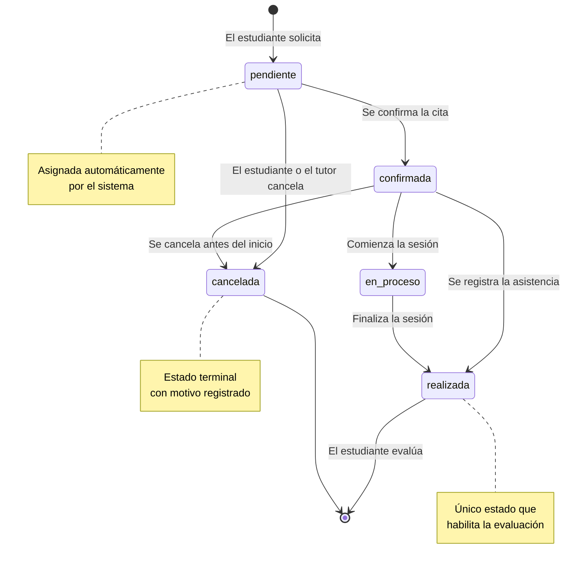
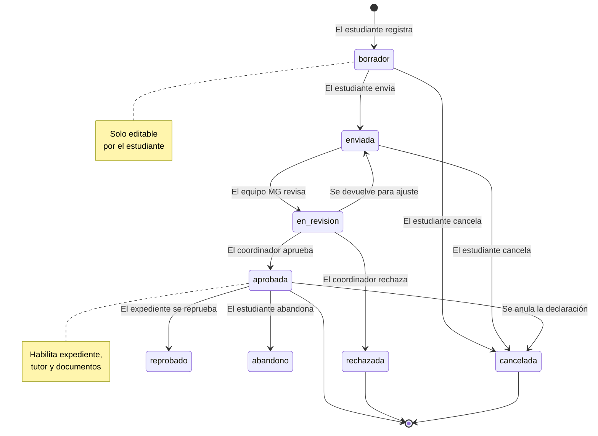
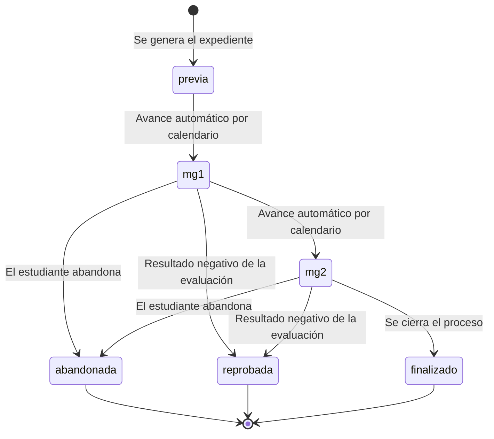
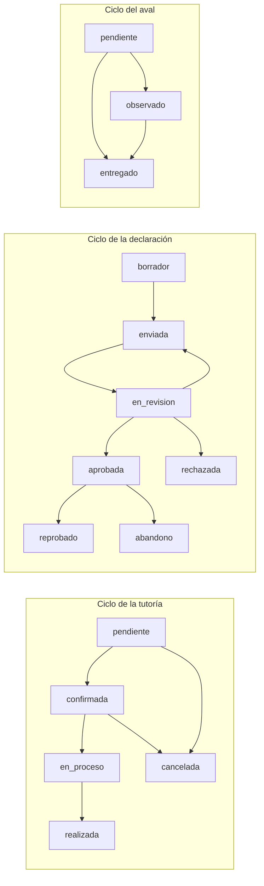
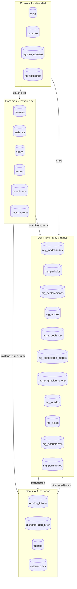

# Modelo Entidad-Relación
## Sistema de Tutorías y Modalidades de Grado

**Modelo de Datos**
**Versión:** 1.0

---

## 1. Introducción

Este documento presenta el **Modelo Entidad-Relación (MER)** del Sistema de
Tutorías y Modalidades de Grado. El MER describe las entidades del dominio, sus
atributos, las relaciones entre ellas y las restricciones que las posean, y constituye
la base conceptual sobre la que se construyó el esquema físico de la base de datos
MySQL.

El modelo se organiza en cuatro dominios funcionales que corresponden a los módulos
del sistema:

1. **Identidad y acceso** — usuarios, roles, auditoría y notificaciones.
2. **Estructura institucional** — carreras, materias y turnos.
3. **Tutorías** — ofertas, disponibilidad, tutorías y evaluaciones.
4. **Modalidades de Grado** — modalidades, declaraciones, avales, expedientes,
   jurados, actas y documentos.

---

## 2. Notación utilizada

| Símbolo | Significado |
|---|---|
| `PK` | Clave primaria |
| `FK` | Clave foránea |
| `UQ` | Restricción de unicidad compuesta |
| `ENUM` | Dominio enumerado de valores permitidos |
| `1` | Cardinalidad uno |
| `N` | Cardinalidad muchos |
| `0..1` | Cardinalidad opcional |

Las cardinalidades se expresan en la forma `(mínimo, máximo)` en la notación
estándar de Chen.

---

## 3. Modelo Entidad-Relación general

```mermaid
erDiagram
    %% ==========================================================
    %% DOMINIO 1: IDENTIDAD Y ACCESO
    %% ==========================================================
    roles ||--o{ usuarios : "clasifica a"
    usuarios ||--o{ registro_accesos : "genera"
    usuarios ||--o{ notificaciones : "recibe"
    usuarios ||--o{ tutores : "perfil de"
    usuarios ||--o{ estudiantes : "perfil de"

    roles {
        int id PK
        string nombre UK "administrador, tutor, estudiante, coordinador_mg, auxiliar_mg"
        string descripcion
    }

    usuarios {
        int id PK
        int rol_id FK
        string usuario UK
        string email UK
        string password_hash "bcrypt"
        string nombres
        string apellidos
        string telefono
        string foto
        boolean activo "default true"
        datetime ultimo_acceso
        datetime creado_en
    }

    registro_accesos {
        int id PK
        int usuario_id FK "nullable"
        string usuario_intento "texto enviado"
        string ip_address
        boolean exito
        string user_agent
        datetime fecha_intento
    }

    notificaciones {
        int id PK
        int usuario_id FK
        string tipo "tutoria, declaracion, aval, sistema"
        string titulo
        text mensaje
        string enlace
        boolean leida "default false"
        datetime creado_en
    }

    %% ==========================================================
    %% DOMINIO 2: ESTRUCTURA INSTITUCIONAL
    %% ==========================================================
    carreras {
        int id PK
        string codigo UK
        string nombre UK
        string nombre_normalizado
        int total_semestres "default 10"
        datetime creado_en
    }

    materias {
        int id PK
        string codigo UK
        string nombre UK
        int creditos
        int carrera_id FK "nullable: materia transversal"
        datetime creado_en
    }

    turnos {
        int id PK
        string codigo UK "M, T, N"
        string nombre "mañana, tarde, noche"
        time hora_inicio
        time hora_fin
    }

    tutor_materia {
        int tutor_id PK,FK
        int materia_id PK,FK
        datetime asignado_en
    }

    tutores {
        int id PK
        int usuario_id FK UK
        string especialidad
        int anos_experiencia
        enum estado "activo, inactivo"
        decimal calificacion_promedio
    }

    estudiantes {
        int id PK
        int usuario_id FK UK
        int carrera_id FK
        string matricula UK
        int semestre
        enum estado "activo, graduado, retiro,uspendido"
        datetime creado_en
    }

    %% ==========================================================
    %% DOMINIO 3: TUTORÍAS
    %% ==========================================================
    tutores ||--o{ tutor_materia : "imparte"
    materias ||--o{ tutor_materia : "es impartida por"
    materias ||--o{ ofertas_tutoria : "define"
    turnos ||--o{ ofertas_tutoria : "organiza"
    tutores ||--o{ ofertas_tutoria : "imparte"
    tutores ||--o{ disponibilidad_tutor : "declara"
    ofertas_tutoria ||--o{ disponibilidad_tutor : "requiere"
    ofertas_tutoria ||--o{ tutorias : "genera"
    estudiantes ||--o{ tutorias : "solicita"
    tutores ||--o{ tutorias : "atiende"
    materias ||--o{ tutorias : "es materia de"
    turnos ||--o{ tutorias : "corresponde a"
    tutorias ||--o{ evaluaciones : "recibe"
    estudiantes ||--o{ evaluaciones : "emite"

    ofertas_tutoria {
        int id PK
        int tutor_id FK
        int materia_id FK
        int turno_id FK
        string nivel_academico "pregrado, posgrado, invierno, verano, personalizado"
        enum modalidad "presencial, virtual"
        string lugar "si modalidad presencial"
        string enlace "si modalidad virtual"
        int cupos "default 30"
        enum estado "abierta, cerrada, asignada, cancelada"
        date fecha_inicio
        date fecha_fin
        datetime creado_en
    }

    disponibilidad_tutor {
        int id PK
        int tutor_id FK
        int oferta_id FK
        int turno_id FK
        enum dia_semana
        time hora_inicio
        time hora_fin
        int capacidad
        int inscritos
    }

    tutorias {
        int id PK
        int estudiante_id FK
        int tutor_id FK
        int materia_id FK
        int turno_id FK
        int oferta_id FK "nullable"
        date fecha
        time hora_inicio
        time hora_fin
        string nivel_academico
        enum modalidad
        string lugar
        string enlace
        enum estado "pendiente, confirmada, en_proceso, realizada, cancelada"
        text observaciones "max 1000"
        string motivo_cancelacion
        datetime creado_en
        datetime actualizado_en
    }

    evaluaciones {
        int id PK
        int tutoria_id FK
        int estudiante_id FK
        int calificacion "1 a 5"
        text comentario
        datetime creado_en
    }

    %% ==========================================================
    %% DOMINIO 4: MODALIDADES DE GRADO
    %% ==========================================================
    mg_modalidades ||--o{ mg_periodos : "se ofrece en"
    mg_periodos ||--o{ mg_cohortes : "agrupa"
    mg_cohortes ||--o{ mg_declaraciones : "agrupa"
    mg_modalidades ||--o{ mg_declaraciones : "es declarada como"
    estudiantes ||--o{ mg_declaraciones : "declara"
    mg_declaraciones ||--o{ mg_avales : "requiere"
    mg_declaraciones ||--o{ mg_expedientes : "genera"
    mg_expedientes ||--o{ mg_expediente_etapas : "avanza por"
    mg_declaraciones ||--o{ mg_asignacion_tutores : "asigna"
    tutores ||--o{ mg_asignacion_tutores : "es asignado"
    mg_declaraciones ||--o{ mg_jurados : "defiende ante"
    usuarios ||--o{ mg_jurados : "participa como"
    mg_declaraciones ||--o| mg_actas : "se evalua en"
    mg_modalidades ||--o{ mg_plantillas : "usa"
    mg_declaraciones ||--o{ mg_documentos : "origina"
    mg_declaraciones ||--o{ mg_importaciones : "se registra en"
    mg_tipos_documento ||--o{ mg_documentos : "clasifica"
    mg_tipos_documento ||--o{ mg_actas : "clasifica"
    usuarios ||--o{ mg_plantillas : "crea"
    usuarios ||--o{ mg_parametros : "modifica"

    mg_modalidades {
        int id PK
        string codigo UK "proyecto_grado, tesis, trabajo_dirigido"
        string nombre UK
        string descripcion
        boolean requiere_tutor
        boolean activo
        datetime creado_en
    }

    mg_periodos {
        int id PK
        string nombre UK
        date fecha_inicio
        date fecha_fin
        enum estado "planificado, abierto, cerrado"
        boolean es_actual
    }

    mg_cohortes {
        int id PK
        int periodo_id FK
        string nombre UK
        date fecha_inicio
        date fecha_fin
        enum estado "planificada, en_curso, cerrada"
    }

    mg_declaraciones {
        int id PK
        int estudiante_id FK
        int modalidad_id FK
        int periodo_id FK
        int cohort_id FK "nullable"
        string titulo_proyecto
        string resumen "max 2000"
        string organizacion
        string tutor_sugerido
        enum estado "borrador, enviada, en_revision, aprobada, rechazada, cancelada, reprobado, abandono"
        text observacion_rechazo
        datetime fecha_envio
        datetime fecha_aprobacion
        datetime creado_en
        datetime actualizado_en
    }

    mg_avales {
        int id PK
        int declaracion_id FK
        string tipo "aval_directora, avaliador, empresa"
        string nombre_aval
        string cargo
        string email
        enum estado "pendiente, entregado, observado"
        text observacion
        string documento_ruta
        string documento_nombre
        datetime fecha_entrega
        datetime creado_en
    }

    mg_expedientes {
        int id PK
        int declaracion_id FK UK
        string numero_expediente UK
        enum etapa_actual "previa, mg1, mg2, finalizado"
        enum estado "en_proceso, aprobado, reprobado, abandono, retirado"
        string ruta_archivo
        datetime creado_en
    }

    mg_expediente_etapas {
        int id PK
        int expediente_id FK
        string etapa "previa, mg1, mg2, final"
        date fecha_inicio
        date fecha_cierre
        enum resultado "activo, aprobado, reprobado, abandono, retirado"
        text observaciones
        int registrado_por FK
        datetime creado_en
    }

    mg_asignacion_tutores {
        int id PK
        int declaracion_id FK
        int tutor_id FK
        string tipo_tutor "modalidad, academico"
        string carta_numero
        date fecha_carta
        date fecha_inicio
        date fecha_fin
        enum estado "vigente, finalizada, reemplazada"
        string motivo_fin
        int asignado_por FK
        datetime creado_en
    }

    mg_jurados {
        int id PK
        int declaracion_id FK
        int usuario_id FK
        string rol_jurado "presidente, titular, suplente"
        string cedula
        string profesion
        string correo
        boolean notificado
        datetime creado_en
    }

    mg_actas {
        int id PK
        int declaracion_id FK UK
        int tipo_documento_id FK
        int expediente_id FK "nullable"
        string numero_acta UK
        date fecha_defensa
        time hora_inicio
        string lugar
        string modalidad
        decimal nota_final
        enum resultado "aprobado, reprobado, empate"
        int presidente_jurado_id FK
        string firma_presidente
        string firma_secretario
        date fecha_firma
        string observaciones
        datetime creado_en
    }

    mg_notas_jurado {
        int id PK
        int acta_id FK
        int jurado_id FK
        decimal nota "0.0 a 5.0"
        text comentario
    }

    mg_tipos_documento {
        int id PK
        string codigo UK "carta_presentacion, acta_defensa, constancia"
        string nombre
        boolean requiere_firma
    }

    mg_plantillas {
        int id PK
        int tipo_documento_id FK
        string nombre
        int version
        text contenido
        boolean activa
        int creado_por FK
        datetime creado_en
    }

    mg_documentos {
        int id PK
        int declaracion_id FK
        int tipo_documento_id FK
        int plantilla_id FK "nullable"
        string correlativo UK
        text contenido "snapshot inmutable"
        string ruta_pdf
        date fecha_emision
        int generado_por FK
        datetime creado_en
    }

    mg_parametros {
        int id PK
        string clave UK
        string valor
        string descripcion
        string tipo_dato "numero, texto, booleano, fecha"
        boolean editable
        int actualizado_por FK
        datetime actualizado_en
    }

    mg_importaciones {
        int id PK
        string tipo "padron, evaluacion"
        string archivo_nombre
        string archivo_ruta
        int total_filas
        int filas_ok
        int filas_advertencia
        int filas_error
        int filas_omitidas
        int filas_pendientes_cuenta
        string estado "procesada, con_errores, fallida"
        int usuario_id FK
        datetime creado_en
    }
```

---

## 4. Dominio 1: Identidad y acceso

### 4.1 Entidades

| Entidad | Descripción | Atributos principales |
|---|---|---|
| **roles** | Catálogo de roles del sistema. | `id`, `nombre`, `descripcion` |
| **usuarios** | Cuenta de acceso al sistema. | `id`, `rol_id`, `usuario`, `email`, `password_hash`, `nombres`, `apellidos`, `activo` |
| **registro_accesos** | Auditoría de los intentos de autenticación. | `id`, `usuario_id`, `usuario_intento`, `ip_address`, `exito`, `fecha_intento` |
| **notificaciones** | Avisos dirigidos al usuario. | `id`, `usuario_id`, `tipo`, `titulo`, `mensaje`, `leida` |

### 4.2 Relaciones

| Relación | Tipo | Descripción |
|---|---|---|
| `roles` → `usuarios` | 1:N | Un rol clasifica a muchos usuarios. |
| `usuarios` → `registro_accesos` | 1:N | Un usuario genera muchos registros de acceso. |
| `usuarios` → `notificaciones` | 1:N | Un usuario recibe muchas notificaciones. |
| `usuarios` → `tutores` | 1:1 | Una cuenta de usuario puede tener un perfil de tutor. |
| `usuarios` → `estudiantes` | 1:1 | Una cuenta de usuario puede tener un perfil de estudiante. |

### 4.3 Restricciones

- `usuarios.usuario` y `usuarios.email` son únicos.
- `usuarios.password_hash` almacena exclusivamente el hash bcrypt.
- `usuarios.activo` debe ser verdadero para permitir el acceso.
- `registro_accesos` conserva los intentos fallidos con `usuario_id` nulo.

---

## 5. Dominio 2: Estructura institucional

### 5.1 Entidades

| Entidad | Descripción | Atributos principales |
|---|---|---|
| **carreras** | Programas académicos de la institución. | `id`, `codigo`, `nombre`, `total_semestres` |
| **materias** | Asignaturas de los programas. | `id`, `codigo`, `nombre`, `creditos`, `carrera_id` |
| **turnos** | Franjas horarias disponibles. | `id`, `codigo`, `nombre`, `hora_inicio`, `hora_fin` |
| **tutor_materia** | Asignación de un tutor a una materia. | `tutor_id`, `materia_id` |
| **tutores** | Perfil docente. | `id`, `usuario_id`, `especialidad`, `estado` |
| **estudiantes** | Perfil del estudiante. | `id`, `usuario_id`, `carrera_id`, `matricula`, `semestre`, `estado` |

### 5.2 Relaciones

| Relación | Tipo | Descripción |
|---|---|---|
| `tutores` ↔ `materias` | N:M | Un tutor imparte varias materias y una materia es impartida por varios tutores, a través de `tutor_materia`. |
| `carreras` → `materias` | 1:N | Una carrera posee muchas materias. |
| `carreras` → `estudiantes` | 1:N | Una carrera tiene muchos estudiantes. |
| `turnos` | entidad de catálogo | Sin relaciones directas; se referencia desde ofertas y tutorías. |

### 5.3 Restricciones

- La clave compuesta `(tutor_id, materia_id)` en `tutor_materia` impide duplicados.
- `materias.carrera_id` es opcional para admitir materias transversales.
- `estudiantes.matricula` es único en toda la institución.
- Los nombres de carrera se validan contra el catálogo institucional.

---

## 6. Dominio 3: Tutorías

### 6.1 Entidades

| Entidad | Descripción | Atributos principales |
|---|---|---|
| **ofertas_tutoria** | Publicación de una tutoría por materia, turno y nivel. | `id`, `tutor_id`, `materia_id`, `turno_id`, `nivel_academico`, `modalidad`, `estado` |
| **disponibilidad_tutor** | Franjas disponibles del tutor para una oferta. | `id`, `tutor_id`, `oferta_id`, `turno_id`, `dia_semana`, `hora_inicio`, `capacidad` |
| **tutorias** | Sesión de tutoría entre un estudiante y un tutor. | `id`, `estudiante_id`, `tutor_id`, `materia_id`, `fecha`, `estado`, `observaciones` |
| **evaluaciones** | Calificación aplicada por el estudiante. | `id`, `tutoria_id`, `estudiante_id`, `calificacion`, `comentario` |

### 6.2 Relaciones

| Relación | Tipo | Descripción |
|---|---|---|
| `ofertas_tutoria` → `tutorias` | 1:N | Una oferta genera muchas tutorías. |
| `estudiantes` → `tutorias` | 1:N | Un estudiante solicita muchas tutorías. |
| `tutores` → `tutorias` | 1:N | Un tutor atiende muchas tutorías. |
| `tutorias` → `evaluaciones` | 1:1 | Una tutoría admite una sola evaluación. |
| `ofertas_tutoria` → `disponibilidad_tutor` | 1:N | Una oferta declara varias franjas de disponibilidad. |

### 6.3 Máquina de estados de la tutoría



### 6.4 Atributos derivados

| Atributo | Entidad | Cálculo |
|---|---|---|
| `dias_disponibles` | Oferta | Días sin conflicto de agenda en el horizonte de 6 meses. |
| `cupos_restantes` | Oferta | `cupos` − `inscritos`. |
| `promedio_tutor` | Tutor | Media de las calificaciones de sus evaluaciones. |
| `tutorias_por_estado` | Dashboard | Recuento agrupado por estado. |

---

## 7. Dominio 4: Modalidades de Grado

### 7.1 Entidades

| Entidad | Descripción | Atributos principales |
|---|---|---|
| **mg_modalidades** | Catálogo de modalidades de grado. | `id`, `codigo`, `nombre`, `requiere_tutor` |
| **mg_periodos** | Periodos académicos del proceso. | `id`, `nombre`, `fecha_inicio`, `fecha_fin`, `estado` |
| **mg_cohortes** | Grupos de estudiantes por periodo. | `id`, `periodo_id`, `nombre`, `estado` |
| **mg_declaraciones** | Declaración de modalidad del estudiante. | `id`, `estudiante_id`, `modalidad_id`, `periodo_id`, `estado` |
| **mg_avales** | Avales requeridos por la declaración. | `id`, `declaracion_id`, `tipo`, `estado`, `documento_ruta` |
| **mg_expedientes** | Expediente académico de la declaración. | `id`, `declaracion_id`, `numero_expediente`, `etapa_actual` |
| **mg_expediente_etapas** | Historial de etapas del expediente. | `id`, `expediente_id`, `etapa`, `fecha_inicio`, `resultado` |
| **mg_asignacion_tutores** | Historial de tutores de modalidad. | `id`, `declaracion_id`, `tutor_id`, `estado` |
| **mg_jurados** | Tribunal de la defensa. | `id`, `declaracion_id`, `usuario_id`, `rol_jurado` |
| **mg_actas** | Acta de la defensa. | `id`, `declaracion_id`, `nota_final`, `resultado`, `fecha_firma` |
| **mg_notas_jurado** | Notas por jurado. | `id`, `acta_id`, `jurado_id`, `nota` |
| **mg_plantillas** | Plantillas versionadas de documentos. | `id`, `tipo_documento_id`, `version`, `contenido`, `activa` |
| **mg_documentos** | Documentos oficiales emitidos. | `id`, `declaracion_id`, `correlativo`, `contenido` |
| **mg_parametros** | Parámetros configurables del módulo. | `id`, `clave`, `valor`, `editable` |
| **mg_importaciones** | Registro de importaciones masivas. | `id`, `tipo`, `total_filas`, `filas_ok`, `filas_error` |

### 7.2 Relaciones

| Relación | Tipo | Descripción |
|---|---|---|
| `estudiantes` → `mg_declaraciones` | 1:N | Un estudiante puede declarar modalidades en distintos periodos. |
| `mg_modalidades` → `mg_declaraciones` | 1:N | Una modalidad es declarada por muchos estudiantes. |
| `mg_periodos` → `mg_declaraciones` | 1:N | Un periodo agrupa las declaraciones de sus participantes. |
| `mg_cohortes` → `mg_declaraciones` | 1:N | Una cohorte agrupa las declaraciones de sus participantes. |
| `mg_declaraciones` → `mg_avales` | 1:N | Una declaración requiere varios avales. |
| `mg_declaraciones` → `mg_expedientes` | 1:1 | Una declaración genera un único expediente. |
| `mg_expedientes` → `mg_expediente_etapas` | 1:N | Un expediente avanza por varias etapas. |
| `mg_declaraciones` → `mg_asignacion_tutores` | 1:N | Una declaración puede tener varios tutores a lo largo del tiempo. |
| `mg_declaraciones` → `mg_jurados` | 1:N | Una declaración tiene un tribunal con varios miembros. |
| `mg_declaraciones` → `mg_actas` | 1:1 | Una declaración se evalúa en un único acta. |
| `mg_actas` → `mg_notas_jurado` | 1:N | Un acta registra la nota de cada jurado. |
| `mg_tipos_documento` → `mg_plantillas` | 1:N | Un tipo de documento tiene varias versiones de plantilla. |
| `mg_tipos_documento` → `mg_documentos` | 1:N | Un tipo de documento genera muchos documentos emitidos. |
| `mg_declaraciones` → `mg_documentos` | 1:N | Una declaración origina varios documentos. |
| `mg_declaraciones` → `mg_importaciones` | 1:N | Una declaración aparece en el detalle de las importaciones. |

### 7.3 Máquina de estados de la declaración



### 7.4 Máquina de estados del expediente



### 7.5 Restricciones

- Existe un máximo de una declaración activa por estudiante, modalidad y periodo.
- Solo las modalidades publicadas pueden ser declaradas.
- Solo las declaraciones en estado *en_revision* pueden ser aprobadas o rechazadas.
- La aprobación exige que todos los avales estén en estado *entregado*.
- La relación entre `mg_declaraciones` y `mg_actas` es 1:1.
- El acta firmada queda inalterable (`fecha_firma` no es modificable).
- `mg_documentos.contenido` conserva la instantánea del documento emitido.
- El `correlativo` de `mg_documentos` es único por tipo de documento y año.
- El historial de `mg_asignacion_tutores` no admite eliminación: las reasignaciones
  marcan el registro anterior como *reemplazada*.

---

## 8. Restricciones de integridad del modelo

### 8.1 Integridad referencial

| Restricción | Comportamiento |
|---|---|
| Claves foráneas con `ON DELETE RESTRICT` | Impide la eliminación de registros con dependientes. |
| Claves foráneas con `ON UPDATE CASCADE` | Mantiene la coherencia al modificar claves primarias. |
| `mg_expedientes.declaracion_id` con `UNIQUE` | Garantiza la relación 1:1 con la declaración. |
| `mg_actas.declaracion_id` con `UNIQUE` | Garantiza un único acta por declaración. |

### 8.2 Integridad de dominio

| Restricción | Implementación |
|---|---|
| Estados controlados | Campos `ENUM` en las tablas de estado. |
| Rangos numéricos | `TINYINT` para calificaciones (1–5) y `DECIMAL` para notas. |
| Unicidad compuesta | `UNIQUE` en `tutor_materia`, `tutorias` y catálogos. |
| Longitudes máximas | `VARCHAR` con longitud definida y `TEXT` para campos extensos. |
| Codificación | `utf8mb4` en todas las tablas de caracteres. |

### 8.3 Diagrama de la máquina de estados consolidada



---

## 9. Diccionario de datos

### 9.1 Tablas de identidad

| Tabla | Campo | Tipo | Clave | Descripción |
|---|---|---|---|---|
| `roles` | `id` | INT | PK | Identificador del rol. |
| `roles` | `nombre` | VARCHAR(50) | UQ | Nombre del rol (`administrador`, `tutor`, `estudiante`, `coordinador_mg`, `auxiliar_mg`). |
| `usuarios` | `id` | INT | PK | Identificador del usuario. |
| `usuarios` | `rol_id` | INT | FK → `roles.id` | Rol asignado. |
| `usuarios` | `usuario` | VARCHAR(50) | UQ | Nombre de usuario para el acceso. |
| `usuarios` | `email` | VARCHAR(120) | UQ | Correo electrónico institucional. |
| `usuarios` | `password_hash` | VARCHAR(255) | — | Hash bcrypt de la contraseña. |
| `usuarios` | `activo` | TINYINT(1) | — | Indica si la cuenta puede autenticarse. |
| `registro_accesos` | `id` | INT | PK | Identificador del registro. |
| `registro_accesos` | `exito` | TINYINT(1) | — | Resultado del intento de acceso. |
| `notificaciones` | `leida` | TINYINT(1) | — | Estado de lectura de la notificación. |

### 9.2 Tablas de estructura institucional

| Tabla | Campo | Tipo | Clave | Descripción |
|---|---|---|---|---|
| `carreras` | `id` | INT | PK | Identificador de la carrera. |
| `carreras` | `codigo` | VARCHAR(20) | UQ | Código institucional de la carrera. |
| `carreras` | `total_semestres` | INT | — | Duración del programa en semestres. |
| `materias` | `id` | INT | PK | Identificador de la materia. |
| `materias` | `creditos` | INT | — | Créditos académicos. |
| `turnos` | `codigo` | VARCHAR(5) | UQ | Código del turno (`M`, `T`, `N`). |
| `tutores` | `especialidad` | VARCHAR(120) | — | Área de especialización del docente. |
| `tutores` | `calificacion_promedio` | DECIMAL(3,2) | — | Promedio de las evaluaciones recibidas. |
| `estudiantes` | `matricula` | VARCHAR(20) | UQ | Matrícula institucional. |
| `estudiantes` | `semestre` | INT | — | Semestre que cursa el estudiante. |

### 9.3 Tablas de tutorías

| Tabla | Campo | Tipo | Clave | Descripción |
|---|---|---|---|---|
| `ofertas_tutoria` | `nivel_academico` | VARCHAR(30) | — | Nivel académico de la oferta. |
| `ofertas_tutoria` | `modalidad` | ENUM | — | `presencial` o `virtual`. |
| `ofertas_tutoria` | `estado` | ENUM | — | `abierta`, `cerrada`, `asignada` o `cancelada`. |
| `ofertas_tutoria` | `cupos` | INT | — | Número máximo de participantes. |
| `disponibilidad_tutor` | `dia_semana` | ENUM | — | Día de la franja disponible. |
| `disponibilidad_tutor` | `capacidad` | INT | — | Cupos de la franja. |
| `tutorias` | `fecha` | DATE | — | Fecha asignada a la sesión. |
| `tutorias` | `estado` | ENUM | — | Estado del ciclo de vida de la tutoría. |
| `tutorias` | `observaciones` | TEXT | — | Notas del estudiante (máx. 1000 caracteres). |
| `evaluaciones` | `calificacion` | TINYINT | — | Calificación de 1 a 5. |
| `evaluaciones` | `comentario` | TEXT | — | Comentario opcional de la evaluación. |

### 9.4 Tablas de modalidades de grado

| Tabla | Campo | Tipo | Clave | Descripción |
|---|---|---|---|---|
| `mg_modalidades` | `requiere_tutor` | TINYINT(1) | — | Indica si la modalidad exige tutor. |
| `mg_periodos` | `es_actual` | TINYINT(1) | — | Marca el periodo vigente. |
| `mg_declaraciones` | `estado` | ENUM | — | Estado del flujo de la declaración. |
| `mg_declaraciones` | `titulo_proyecto` | VARCHAR(200) | — | Título del proyecto o investigación. |
| `mg_avales` | `estado` | ENUM | — | `pendiente`, `entregado` u `observado`. |
| `mg_expedientes` | `numero_expediente` | VARCHAR(30) | UQ | Número único del expediente. |
| `mg_expedientes` | `etapa_actual` | ENUM | — | `previa`, `mg1`, `mg2` o `finalizado`. |
| `mg_actas` | `nota_final` | DECIMAL(3,2) | — | Promedio de las notas del tribunal. |
| `mg_actas` | `resultado` | ENUM | — | `aprobado`, `reprobado` o `empate`. |
| `mg_actas` | `fecha_firma` | DATE | — | Fecha de firma; sella el acta. |
| `mg_documentos` | `correlativo` | VARCHAR(30) | UQ | Número correlativo por tipo y año. |
| `mg_documentos` | `contenido` | TEXT | — | Instantánea inmutable del documento emitido. |
| `mg_parametros` | `clave` | VARCHAR(50) | UQ | Nombre del parámetro. |
| `mg_parametros` | `editable` | TINYINT(1) | — | Permite la modificación desde la interfaz. |
| `mg_importaciones` | `total_filas` | INT | — | Filas procesadas en la importación. |
| `mg_importaciones` | `filas_error` | INT | — | Filas con error de procesamiento. |

---

## 10. Diccionario de restricciones

| Tipo | Descripción | Ejemplo |
|---|---|---|
| **Clave primaria** | Identificador único e irrepetible de cada entidad. | `usuarios.id` |
| **Clave foránea** | Referencia a la clave primaria de otra entidad. | `tutorias.tutor_id` → `tutores.id` |
| **Unicidad** | Garantiza que el valor no se repita. | `usuarios.email` |
| **Unicidad compuesta** | Garantiza la combinación única de varios campos. | `(tutor_id, materia_id)` en `tutor_materia` |
| **Dominio enumerado** | Limita el valor a un conjunto permitido. | `tutorias.estado` |
| **No nulidad** | El campo es obligatorio. | `usuarios.usuario` |
| **Valor por defecto** | Valor asignado al omitir el campo. | `usuarios.activo` = `true` |
| **Longitud máxima** | Limita el tamaño del dato. | `tutorias.observaciones` ≤ 1000 |
| **Rango numérico** | Limita el valor entre un mínimo y un máximo. | `evaluaciones.calificacion` entre 1 y 5 |

---

## 11. Diagrama de dependencias entre dominios



---

*Fin del documento de Modelo Entidad-Relación*
