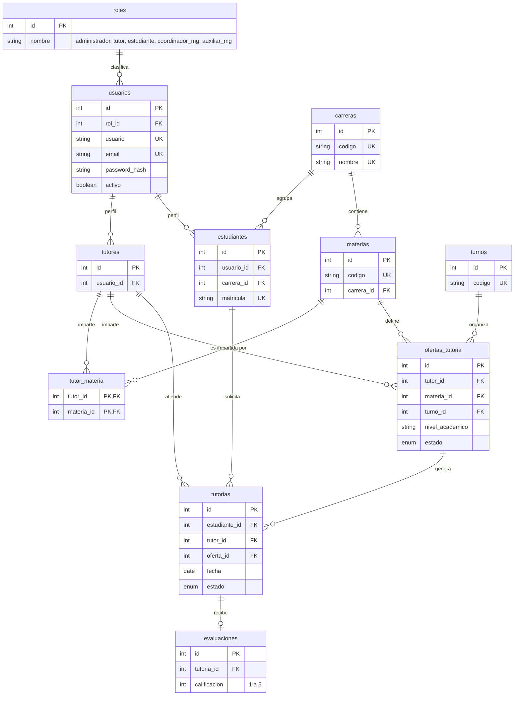
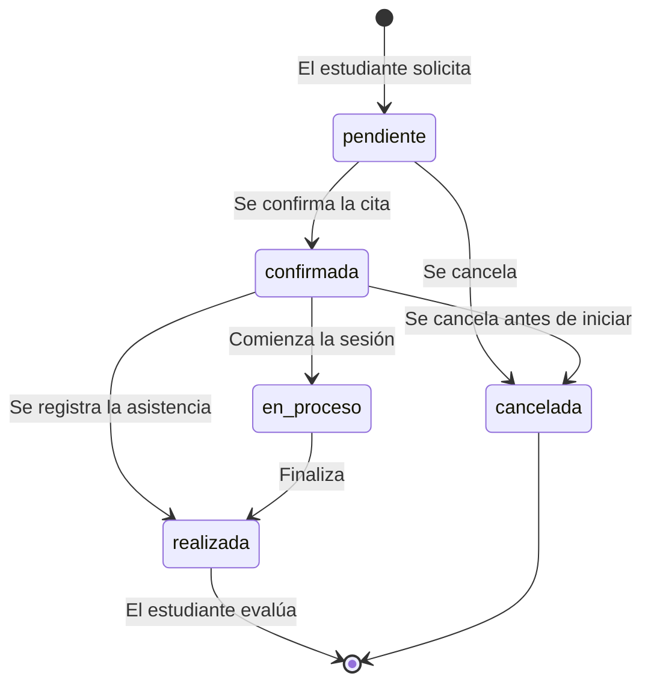
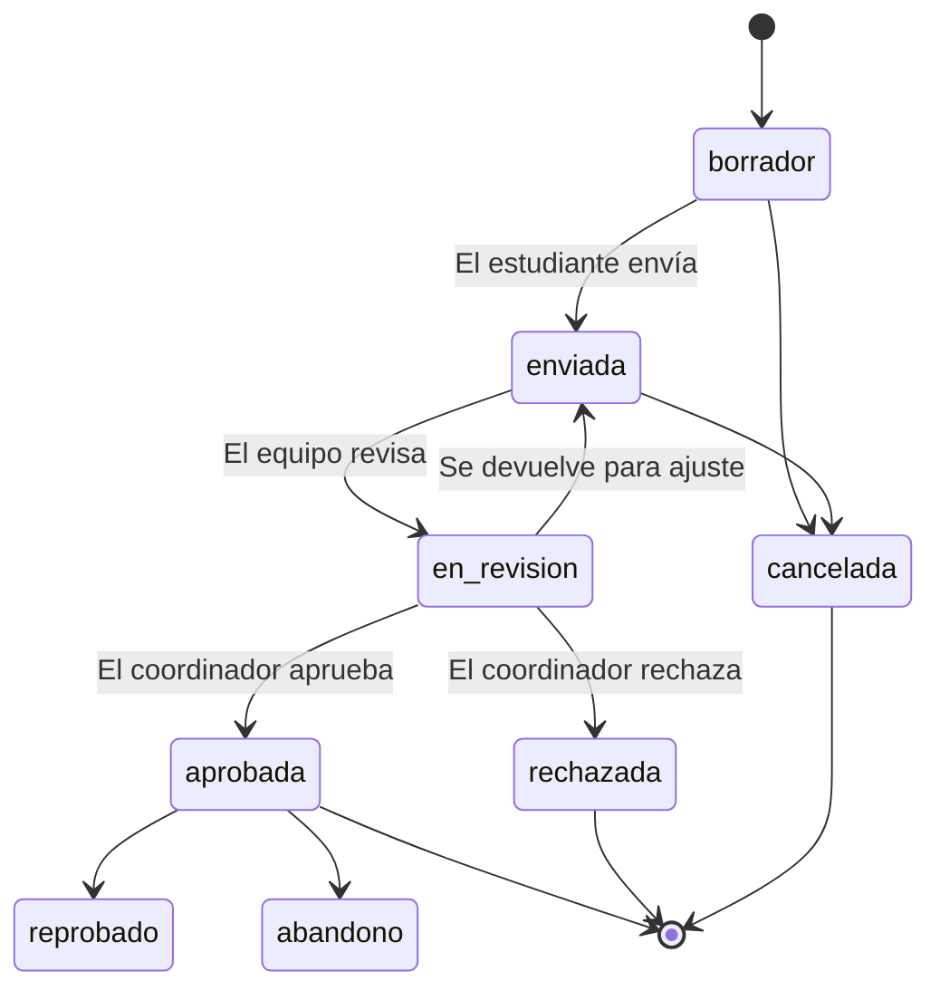
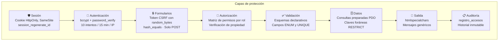
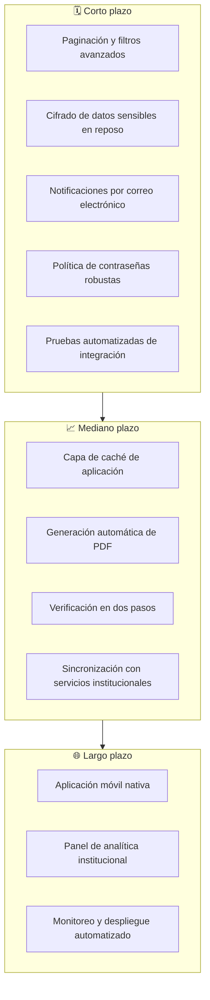

# Presentación de Defensa
## Sistema de Tutorías y Modalidades de Grado

**Guion de Presentación — 15 diapositivas**
**Duración estimada:** 15 a 20 minutos

---

## Diapositiva 1 · Portada

**Sistema de Tutorías y Modalidades de Grado**

- Nombre de la institución
- Nombre del proyecto
- Asignatura / materia
- Autor(es)
- Tutor académico
- Fecha de presentación

> **Explicación (30 s).** «Buenos días. Mi nombre es […] y presento el proyecto
> *"Sistema de Tutorías y Modalidades de Grado"*, desarrollado dentro de la
> asignatura […]. El objetivo del trabajo es automatizar dos procesos que hasta ahora
> se manejan de forma manual: la gestión de las tutorías y la gestión de las
> modalidades de grado. En los siguientes minutos presentaré el problema, la
> solución, la arquitectura del sistema, el modelo de datos, la seguridad y los
> resultados obtenidos.»

---

## Diapositiva 2 · Problema y justificación

**Situación actual**

- Las ofertas de tutoría se coordinan por medios informales.
- La disponibilidad de los tutores se lleva en cuadernos o archivos dispersos.
- Los procesos de modalidad de grado se siguen con planillas dispersas.
- Los expedientes, avales y actas se archivan en carpetas físicas.
- No existe un historial centralizado de cambios de estado.

**Consecuencias**

- Pérdida de información y de trazabilidad.
- Reprocesamiento de datos y errores por digitación.
- Tiempos de respuesta largos para el estudiante.
- Dificultad para obtener indicadores de gestión.

> **Explicación (1 min).** «El problema central era la dispersión de la
> información. Una misma estudiante podía tener su declaración en una planilla, sus
> avales en una carpeta y el estado de su expediente en un correo. Esto generaba
> pérdida de trazabilidad y dependía de una sola persona. El sistema
> propuesto centraliza esa información y garantiza que cada cambio quede registrado.»

---

## Diapositiva 3 · Objetivos

**Objetivo general**

Desarrollar un sistema web que gestione de extremo a extremo los procesos de
tutorías y modalidades de grado de una institución de educación superior.

**Objetivos específicos**

1. Automatizar el ciclo de vida de las tutorías.
2. Automatizar el proceso de modalidades de grado.
3. Implementar seguridad con cinco roles y permisos diferenciados.
4. Garantizar la integridad de la información mediante restricciones en la base de
   datos.
5. Entregar un sistema desplegable de forma reproducible.
6. Documentar el ciclo de vida completo del software.

> **Explicación (1 min).** «Los objetivos se formularon de manera que cada uno pudiera
> verificarse. Los dos primeros son funcionales. El tercero se verifica mediante la
> matriz de permisos. El cuarto, mediante las restricciones del esquema. El quinto,
> mediante el despliegue con Docker. Y el sexto, mediante los doce documentos
> entregados.»

---

## Diapositiva 4 · Alcance y actores

**Módulos del sistema**

| Módulo | Contenido |
|---|---|
| Identificación y acceso | Autenticación, sesión, notificaciones, perfil. |
| Núcleo institucional | Usuarios, roles, carreras, materias, turnos. |
| Tutorías | Ofertas, disponibilidad, solicitudes, estados, evaluaciones. |
| Modalidades de Grado | Modalidades, declaraciones, avales, expedientes, tribunal, actas, documentos. |

**Los cinco actores del sistema**

| Actor | Responsabilidad principal |
|---|---|
| **Administrador** | Gestión total: usuarios, catálogos, ofertas, estados, dashboard. |
| **Tutor** | Aceptar ofertas, declarar disponibilidad, gestionar sus tutorías. |
| **Estudiante** | Solicitar y evaluar tutorías; declarar modalidad de grado. |
| **Coordinador MG** | Coordinar el proceso: catálogo, revisión, aprobación, parámetros. |
| **Auxiliar MG** | Operación diaria: avales, importaciones, expedientes, tribunal, actas. |

> **Explicación (1 min).** «El sistema define cinco roles, que reflejan la estructura
> real de la institución. Cada rol tiene un alcance distinto: el administrador opera
> sobre todo el sistema; el tutor y el estudiante participan en el proceso de
> tutoría; y dentro del módulo de modalidades de grado, el coordinador toma las
> decisiones de aprobación mientras que el auxiliar ejecuta las tareas operativas.
> Esta separación entre decisión y ejecución es clave para el control del proceso.»

---

## Diapositiva 5 · Diagrama de casos de uso

```mermaid
graph TB
    subgraph ACT["Actores"]
        AD["👤 Administrador"]
        TU["👤 Tutor"]
        ES["👤 Estudiante"]
        CO["👤 Coordinador MG"]
        AU["👤 Auxiliar MG"]
    end

    subgraph SIST["Sistema de Tutorías y Modalidades de Grado"]
        subgraph IDENT["Módulo de Identificación"]
            UC01["UC-01<br/>Iniciar sesión"]
            UC02["UC-02<br/>Cerrar sesión"]
            UC03["UC-03<br/>Consultar notificaciones"]
            UC04["UC-04<br/>Editar perfil"]
        end

        subgraph TUT["Módulo de Tutorías"]
            UC10["UC-10<br/>Crear oferta"]
            UC11["UC-11<br/>Aceptar / rechazar oferta"]
            UC12["UC-12<br/>Configurar disponibilidad"]
            UC13["UC-13<br/>Solicitar tutoría"]
            UC14["UC-14<br/>Cambiar estado"]
            UC15["UC-15<br/>Evaluar tutoría"]
            UC16["UC-16<br/>Ver dashboard"]
            UC17["UC-17<br/>Ver mis estudiantes"]
        end

        subgraph MG["Módulo de Modalidades de Grado"]
            UC20["UC-20<br/>Registrar modalidad"]
            UC21["UC-21<br/>Publicar modalidad"]
            UC22["UC-22<br/>Declarar modalidad"]
            UC23["UC-23<br/>Gestionar avales"]
            UC24["UC-24<br/>Revisar declaración"]
            UC25["UC-25<br/>Aprobar / rechazar"]
            UC26["UC-26<br/>Importar padrón CSV"]
            UC27["UC-27<br/>Asignar tutor de modalidad"]
            UC28["UC-28<br/>Registrar etapa"]
            UC29["UC-29<br/>Asignar jurado"]
            UC30["UC-30<br/>Registrar acta"]
            UC31["UC-31<br/>Generar documento"]
            UC32["UC-32<br/>Configurar parámetros"]
        end
    end

    AD --> UC01 & UC10 & UC14 & UC16 & UC20 & UC25 & UC40
    TU --> UC01 & UC11 & UC12 & UC14 & UC17
    ES --> UC01 & UC13 & UC14 & UC15 & UC22
    CO --> UC01 & UC20 & UC24 & UC25 & UC27 & UC32
    AU --> UC01 & UC23 & UC24 & UC26 & UC28 & UC29 & UC30 & UC31

    UC24 -.->|"include"| UC23
    UC14 -.->|"extend"| UC03
    UC30 -.->|"include"| UC32
```



> **Explicación (1.5 min).** «Este es el diagrama de casos de uso. Se especificaron
> 27 casos organizados en cuatro módulos. Hay que destacar las relaciones de
> inclusão y extensión: la revisión de una declaración *incluye* la verificación de
> los avales, y el registro del acta *incluye* el cálculo de la nota final según los
> parámetros configurados. El cambio de estado, por su parte, *extiende* el caso de
> notificaciones. Nótese que el estudiante no accede a la gestión de avales ni a la
> revisión: su participación en el módulo de grado se limita a declarar y seguir su
> proceso.»

---

## Diapositiva 6 · Requisitos

**Funcionales**

| ID | Descripción resumida |
|---|---|
| RF-001 – RF-011 | Autenticación, sesión, notificaciones y perfil. |
| RF-012 – RF-020 | Usuarios, roles, carreras, materias, turnos. |
| RF-021 – RF-041 | Ofertas, disponibilidad, solicitudes, estados, evaluaciones. |
| RF-042 – RF-050 | Panel de indicadores y filtros. |
| RF-051 – RF-080 | Catálogo, declaración, avales, expedientes, tribunal, actas, documentos. |
| RF-081 – RF-083 | Aplicación de permisos por rol. |

**No funcionales**

| ID | Descripción resumida |
|---|---|
| RNF-001 – RNF-005 | Rendimiento, índices y conexiones persistentes. |
| RNF-006 – RNF-015 | Contraseñas, consultas preparadas, CSRF, sesiones, permisos, auditoría. |
| RNF-016 – RNF-021 | Usabilidad e identidad visual. |
| RNF-022 – RNF-029 | Mantenibilidad y versionado del esquema. |
| RNF-030 – RNF-043 | Portabilidad, confiabilidad, integridad y compatibilidad. |

> **Explicación (1 min).** «Se especificaron 83 requisitos funcionales y 43 no
> funcionales. Un aspecto importante es que los requisitos no funcionales no se
> dejaron como declaraciones generales: cada uno tiene un criterio de aceptación
> verificable. Por ejemplo, el requisito de seguridad de contraseñas tiene como
> criterio "el campo almacenado es un hash bcrypt", y el de rendimiento, "la consulta
> del panel responde en menos de dos segundos con diez mil registros".»

---

## Diapositiva 7 · Arquitectura del sistema

```mermaid
graph TB
    subgraph CLIENTE["🖥️ Cliente (Navegador)"]
        HTML["HTML5 / CSS3"]
        VUE["Vue.js 3 (CDN)"]
        JS["JavaScript + Fetch API"]
    end

    subgraph SERVIDOR["🖧 Servidor — Apache + PHP 8.2"]
        subgraph VISTAS["Capa de Presentación"]
            V["Vistas PHP<br/>Generan HTML escapado"]
        end

        subgraph CTRL["Capa de Control"]
            C1["Autenticación"]
            C2["Tutorías"]
            C3["Modalidades de Grado"]
            C4["Dashboard"]
            C5["Usuarios y catálogos"]
        end

        subgraph NUC["Capa de Núcleo"]
            N1["Validador"]
            N2["Autenticación y sesión"]
            N3["Gestor de permisos"]
            N4["Notificaciones"]
        end

        subgraph MODELOS["Capa de Modelo"]
            M["Modelos PDO"]
        end
    end

    subgraph DATOS[("🗄️ MySQL 8.0")]
        DB[("InnoDB · utf8mb4")]
    end

    HTML --> VUE
    VUE --> JS
    JS -->|"Petición HTTP"| CTRL
    CTRL --> NUC
    NUC --> MODELOS
    MODELOS -->|"Consultas preparadas"| DATOS
    CTRL --> VISTAS
    VISTAS -->|"HTML + JSON"| CLIENTE

    SEC["🔒 CSRF · Escape · Validación · bcrypt"] -.-> CTRL
    SEC -.-> MODELOS
```

> **Explicación (1.5 min).** «La arquitectura sigue el patrón Modelo-Vista-Controlador
> con un front controller único. La petición entra por un solo punto, se resuelve la
> ruta y se entrega al controlador correspondiente. El controlador verifica el
> permiso, valida la entrada y llama al modelo; el modelo ejecuta consultas
> preparadas y devuelve los datos; finalmente la vista genera el HTML escapando
> toda salida dinámica. Un detalle relevante: la base de datos no se expone al
> exterior, solo es accesible desde la red interna de los contenedores.»

---

## Diapositiva 8 · Modelo de datos



> **Explicación (1.5 min).** «El modelo tiene 33 tablas organizadas en cuatro
> dominios. Aquí se muestra el núcleo del módulo de tutorías. Las decisiones más
> relevantes son: la tabla puente `tutor_materia`, que resuelve la relación de
> muchos a muchos entre tutores y materias; la relación uno a uno entre `tutorias` y
> `evaluaciones`, que garantiza que una tutoría se evalúe una sola vez; y el uso de
> campos ENUM para los estados, que hace que el propio motor de base de datos
> rechace valores no contemplados en el modelo.»

---

## Diapositiva 9 · Flujo de la tutoría y la declaración

**Ciclo de la tutoría**



**Ciclo de la declaración**



> **Explicación (1.5 min).** «Estas son las dos máquinas de estado que gobiernan los
> procesos centrales. Lo relevante es que las transiciones están controladas: el
> sistema impide, por ejemplo, pasar de pendiente a realizada, o evaluar una tutoría
> que no se ha realizado. Además, hay una diferencia de diseño entre ambos ciclos:
> en la tutoría la cancelación es una salida normal del proceso, mientras que en la
> declaración la transición a en revisión puede devolver el caso al estudiante para
> ajustes, generando así un ciclo de corrección antes de la decisión final.»

---

## Diapositiva 10 · Seguridad



**Amenazas cubiertas**

| Amenaza | Control |
|---|---|
| Inyección SQL | Consultas preparadas al 100%. |
| XSS | Escape de toda salida dinámica. |
| CSRF | Token por sesión con comparación en tiempo constante. |
| Fuerza bruta | 10 intentos fallidos por IP cada 15 minutos. |
| Robo de credenciales | bcrypt + mensajes genéricos. |
| Acceso no autorizado | Matriz de permisos + verificación de propiedad. |
| Fijación de sesión | Regeneración del identificador tras autenticar. |
| Manipulación de archivos | Validación de tipo, tamaño y nombre generado. |

> **Explicación (1.5 min).** «La seguridad se aplicó por capas, desde el arranque de
> la sesión hasta la entrega de la respuesta. El punto más importante es que la
> protección no depende de la disciplina del programador: las consultas preparadas
> y la capa centralizada de permisos son estructurales, es decir, el sistema no ofrece
> una forma de consultar la base de datos sin parametrización. Se implementaron
> veinticuatro controles, documentados con su amenaza asociada en el documento de
> seguridad.»

---

## Diapositiva 11 · Tecnologías utilizadas

| Categoría | Tecnología | Versión |
|---|---|---|
| Lenguaje del servidor | PHP | 8.2 |
| Servidor web | Apache | 2.4 |
| Base de datos | MySQL | 8.0 |
| Acceso a datos | PDO | Extensión nativa |
| Estructuración | HTML5 | — |
| Estilos | CSS3 | — |
| Lógica del cliente | JavaScript | ES6+ |
| Framework del cliente | Vue.js | 3.x (CDN) |
| Iconos | Font Awesome | 6.x |
| Contenedores | Docker / Compose | — |
| Versionado del código | Git | — |
| Diagramas | Mermaid | — |

**Decisiones destacadas**

- Sin frameworks PHP: decisión impuesta por el proyecto.
- Vue.js por CDN: evita el proceso de compilación.
- Parámetros en base de datos: las reglas de negocio no se modifican en el código.
- Migraciones versionadas: el esquema evoluciona de forma reproducible.

> **Explicación (1 min).** «Todas las tecnologías utilizadas son de código abierto.
> La restricción más significativa fue no poder usar frameworks PHP, lo que obligó
> a implementar manualmente el enrutamiento, la capa de datos y los mecanismos de
> seguridad. Esa decisión, que en el momento limitaba el desarrollo, se convirtió
> después en la principal fuente de aprendizaje del proyecto. La segunda decisión
> relevante fue usar Vue.js desde el CDN: evita tener una cadena de compilación en el
> despliegue y mantiene el sistema simple de instalar.»

---

## Diapositiva 12 · Pruebas y resultados

| Categoría | Casos | Cobertura |
|---|---|---|
| Autenticación y acceso | 10 | Acceso seguro al sistema. |
| Seguridad | 14 | Inyección, CSRF, XSS, control de acceso. |
| Ofertas y disponibilidad | 9 | Publicación de tutorías. |
| Solicitud y seguimiento | 15 | Ciclo de vida de la tutoría. |
| Evaluación e indicadores | 10 | Valoración y gestión. |
| Usuarios, roles y catálogos | 8 | Administración institucional. |
| Modalidades de grado | 39 | Catálogo, declaración y operación. |
| Interfaz y usabilidad | 7 | Calidad de la interacción. |
| Rendimiento y despliegue | 8 | Desempeño y operación. |
| **Total** | **120** | — |

| Prioridad | Casos | Porcentaje |
|---|---|---|
| Alta | 78 | 65.0% |
| Media | 37 | 30.8% |
| Baja | 5 | 4.2% |

> **Explicación (1 min).** «Se definieron 120 casos de prueba, de los cuales el
> sesenta y cinco por ciento son de prioridad alta, es decir, verifican
> funcionalidades esenciales. Cada caso tiene trazabilidad explícita a los requisitos
> que valida, de modo que es posible verificar que no existe ningún requisito sin
> prueba asociada. Los casos de seguridad comprueban que un intento de inyección SQL
> se trata como texto, que un token CSRF alterado rechaza la operación y que un tutor
> no puede acceder a las tutorías de otro tutor.»

---

## Diapositiva 13 · Limitaciones

| Categoría | Limitación | Impacto |
|---|---|---|
| Técnica | Sin caché de aplicación | Recálculo de consultas del panel. |
| Técnica | Sin paginación completa | El volumen de filas crece con el uso. |
| Funcional | Notificaciones solo internas | El usuario debe ingresar al sistema. |
| Funcional | Sin generación automática de PDF | La impresión es un proceso posterior. |
| Operativa | Requiere Docker | Sin contenedores, la instalación es manual. |
| Seguridad | Sin cifrado de datos en reposo | Los datos se almacenan sin cifrar. |
| Seguridad | Sin segundo factor de autenticación | El acceso depende del par usuario-contraseña. |
| Infraestructura | Base de datos en un único contenedor | La caída del contenedor detiene el sistema. |
| Alcance | No incluye matrícula ni facturación | Fuera del objetivo del proyecto. |

> **Explicación (1 min).** «Como todo sistema tiene límites, los identificamos y los
> documentamos de manera explícita. Las limitaciones más significativas son la
> ausencia de caché y de paginación completa, que se irán agravando con el crecimiento
> de los datos; y la ausencia de cifrado en reposo y de segundo factor de
> autenticación, que serían los primeros puntos a reforzar para un uso productivo.
> Documentar estas limitaciones es tan importante como documentar las
> funcionalidades, porque define el alcance real del sistema.»

---

## Diapositiva 14 · Trabajo futuro



> **Explicación (1 min).** «El trabajo futuro se organizó en tres horizontes. A corto
> plazo, las acciones con mayor efecto son la paginación, el cifrado en reposo y las
> notificaciones por correo, porque atacan directamente las limitaciones más
> citadas. A mediano plazo se establecerían la caché y la generación de PDF. Y a
> largo plazo se abriría el sistema a la integración con los demás servicios
> institucionales y a una aplicación móvil. Se documentaron cuarenta líneas de
> trabajo, priorizadas y justificadas en el documento correspondiente.»

---

## Diapositiva 15 · Conclusiones

**Resultados obtenidos**

- ✅ Sistema completo con dos módulos funcionales: tutorías y modalidades de grado.
- ✅ Cinco roles con matriz de permisos diferenciada.
- ✅ 33 tablas con integridad garantizada en el motor de base de datos.
- ✅ 24 controles de seguridad implementados.
- ✅ 83 requisitos funcionales y 43 no funcionales especificados.
- ✅ 120 casos de prueba con trazabilidad a requisitos.
- ✅ 12 documentos técnicos y de usuario.
- ✅ Despliegue reproducible con Docker Compose.

**Conclusiones finales**

> «El sistema cumple los objetivos propuestos. La restricción de no usar frameworks
> PHP constituyó el mayor desafío técnico, pero se convirtió en la principal fuente
> de aprendizaje: permitió comprender el ciclo completo de una petición HTTP, la
> estructura del patrón MVC y los mecanismos de protección del lenguaje.
>
> El resultado es un sistema funcional, seguro, documentado y desplegable, capaz de
> responder a las necesidades de los cinco roles que participan en los procesos de
> tutoría y modalidades de grado.»

**Cierre**

- Preguntas y respuestas
- Contacto
- Demostración del sistema

> **Explicación (1 min).** «Para cerrar, resumo los resultados: dos módulos
> funcionales completos, cinco roles con permisos diferenciados, 33 tablas, 24
> controles de seguridad, 120 casos de prueba y 12 documentos de entrega. El sistema
> cumple con los objetivos propuestos y representa una base sólida para su uso en el
> contexto académico. Muchas gracias por su atención. Quedo atento a sus
> preguntas.»

---

## Anexo A · Posibles preguntas del jurado

| # | Pregunta probable | Respuesta sugerida |
|---|---|---|
| 1 | ¿Por qué no utilizaron un framework? | Porque el proyecto lo restringe expresamente, y no usar un framework permitió comprender el ciclo completo de una petición HTTP, el enrutamiento, la capa de datos y los mecanismos de seguridad. |
| 2 | ¿Cómo garantizan que no haya inyección SQL? | Todas las consultas se ejecutan mediante PDO con parámetros vinculados; el sistema no expone ninguna vía de consulta por concatenación de cadenas. |
| 3 | ¿Qué impide que un tutor vea datos de otro tutor? | La autorización combina el permiso del rol con la verificación de propiedad: el tutor solo accede a las tutorías donde figura como tutor asignado. |
| 4 | ¿Qué pasa si un estudiante intenta cancelar una tutoría ya realizada? | La transición no está permitida en la máquina de estados; el sistema rechaza la operación indicando los estados involucrados. |
| 5 | ¿Cómo se evita la dependencia de una base de datos ya modificada? | Mediante migraciones versionadas e idempotentes registradas en `schema_migrations`, que permiten reconstruir el esquema desde cero. |
| 6 | ¿Por qué guardar una instantánea del documento emitido? | Para que el documento conserve su contenido original aunque la plantilla se modifique posteriormente, garantizando la trazabilidad de lo emitido. |
| 7 | ¿Qué pasa si una fila del CSV tiene un error? | Cada fila se procesa de forma independiente: un error no invalida el resto, y el sistema reporta el resultado por fila. |
| 8 | ¿Cómo se manejan los datos personales? | Se validan y escapan en servidor y en la salida, se registran los accesos, y toda la información se almacena con codificación `utf8mb4`. |
| 9 | ¿Por qué eligieron Vue.js por CDN y no compilado? | Para evitar un proceso de compilación en el despliegue, reduciendo la complejidad de la cadena de herramientas. |
| 10 | ¿El sistema está listo para producción? | Cumple con el alcance académico. Para un entorno productivo se requeriría reforzar las limitaciones documentadas, principalmente cifrado en reposo, respaldo automatizado y alta disponibilidad. |

---

*Fin de la Presentación de Defensa*
