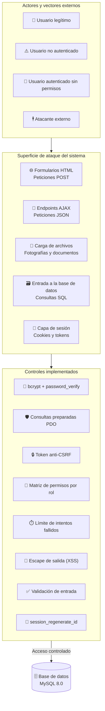
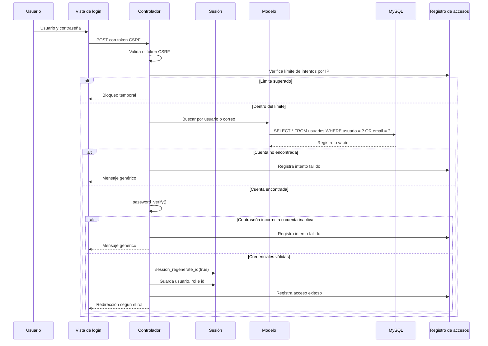
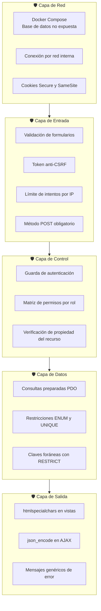

# Seguridad del Sistema
## Sistema de Tutorías y Modalidades de Grado

**Análisis de Seguridad**
**Versión:** 1.0

---

## 1. Introducción

Este documento describe las medidas de seguridad implementadas en el Sistema de
Tutorías y Modalidades de Grado. La seguridad es un requisito transversal que
atraviesa todas las capas de la aplicación, desde la recepción de la petición HTTP
hasta la entrega de la respuesta al cliente.

Los objetivos de seguridad del sistema son:

- **Confidencialidad** — proteger la información sensible de los estudiantes,
  docentes y del proceso académico.
- **Integridad** — garantizar que la información no sea alterada de forma indebida.
- **Disponibilidad** — asegurar que el sistema esté accesible para sus usuarios
  legítimos.
- **Autenticación y autorización** — garantizar que cada usuario acceda únicamente a
  las operaciones que le corresponden.

---

## 2. Modelo de amenazas

### 2.1 Superficie de ataque



### 2.2 Amenzas identificadas

| # | Amenaza | Descripción | Vector | Control aplicado |
|---|---|---|---|---|
| A-01 | **Inyección SQL** | Inserción de código malicioso en las consultas. | Formularios y AJAX | Consultas preparadas PDO parametrizadas. |
| A-02 | **Cross-Site Scripting (XSS)** | Inyección de scripts en las páginas generadas. | Salida de datos | `htmlspecialchars()` en todas las vistas. |
| A-03 | **Cross-Site Request Forgery (CSRF)** | Suplantación de la identidad del usuario mediante peticiones falsificadas. | Formularios | Token por sesión con `hash_equals()`. |
| A-04 | **Roba de credenciales** | Obtención de contraseñas por fuerza bruta o filtraciones. | Formulario de acceso | bcrypt, limitación de intentos y auditoría. |
| A-05 | **Acceso no autorizado** | Un usuario accede a funciones de otro rol. | Peticiones HTTP directas | Matriz de permisos y guardas de sesión. |
| A-06 | **Escalada de privilegios** | Un usuario modifica su propio rol o estado. | Peticiones manipuladas | Permisos de escritura negados por rol. |
| A-07 | **Subida de archivos maliciosos** | Carga de archivos con extensión o contenido peligroso. | Carga de documentos | Validación de tipo, tamaño y nombre generado. |
| A-08 | **Fijación de sesión** | Reutilización del identificador de sesión por un atacante. | Manipulación de cookies | `session_regenerate_id(true)` tras autenticar. |
| A-09 | **Exposición de información** | Revelación de datos por mensajes de error. | Formulario de acceso | Mensajes genéricos de credenciales. |
| A-10 | **Denegación de servicio** | Agotamiento de recursos por peticiones masivas. | Peticiones repetidas | Límite de intentos, paginación y consultas optimizadas. |

---

## 3. Autenticación

### 3.1 Almacenamiento de contraseñas

Las contraseñas **nunca se almacenan en texto plano**. El sistema utiliza el
algoritmo **bcrypt**, provisto por PHP mediante `password_hash()` con la constante
`PASSWORD_DEFAULT`.

```php
// Registro de usuario
$hash = password_hash($password, PASSWORD_DEFAULT);

// Verificación en el inicio de sesión
if (password_verify($password, $usuario['password_hash'])) {
    // Credenciales correctas
}
```

**Características de bcrypt aplicadas**

| Propiedad | Valor | Efecto |
|---|---|---|
| **Algoritmo** | bcrypt | Resistente a ataques con hardware especializado. |
| **Costo** | Configurado por PHP (por defecto 10) | Incrementa el tiempo de cómputo por hash. |
| **Sal** | Generada automáticamente por `password_hash()` | Dos contraseñas idénticas producen hashes distintos. |
| **Verificación** | `password_verify()` en tiempo constante | Evita comparaciones vulnerables a temporización. |

### 3.2 Flujo de autenticación



### 3.3 Control de intentos fallidos

| Atributo | Valor |
|---|---|
| **Límite** | 10 intentos fallidos |
| **Ventana de tiempo** | 15 minutos |
| **Unidad de control** | Dirección IP de origen |
| **Persistencia** | Tabla `registro_accesos` |

Este mecanismo dificulta los ataques de fuerza bruta, ya que el atacante debe rotar
direcciones IP para superar el umbral, lo que eleva significativamente el costo del
ataque.

---

## 4. Control de sesiones

| Medida | Implementación | Propósito |
|---|---|---|
| **Cookie HttpOnly** | Configuración de `session.cookie_httponly` | Impide que JavaScript acceda al identificador de sesión. |
| **Cookie Secure** | Activada en entorno HTTPS | Evita el envío del identificador en texto plano. |
| **Cookie SameSite** | Configuración `Lax` o `Strict` | Reduce el riesgo de CSRF y de fugas de sesión. |
| **Renovación del identificador** | `session_regenerate_id(true)` tras autenticar | Evita la fijación de sesión. |
| **Guarda de autenticación** | Verificación en cada punto de entrada | Impide el acceso a áreas protegidas sin sesión. |
| **Destrucción de sesión** | `session_destroy()` + expiración de cookies | Garantiza el cierre efectivo de la sesión. |
| **Timeout de inactividad** | Controlado por la configuración de PHP | Limita la ventana de exposición de una sesión abierta. |

---

## 5. Protección contra CSRF

Todas las operaciones que modifican información (crear, actualizar, eliminar) exigen
un **token anti-CSRF** válido, almacenado en la sesión y enviado como campo
oculto del formulario.

```php
// Generación del token
$_SESSION['csrf_token'] = bin2hex(random_bytes(32));

// Validación
function verificarCsrf() {
    $tokenSesion = $_SESSION['csrf_token'] ?? '';
    $tokenFormulario = $_POST['csrf_token'] ?? '';
    return hash_equals($tokenSesion, $tokenFormulario);
}
```

**Propiedades aplicadas**

| Propiedad | Detalle |
|---|---|
| **Generación criptográfica** | `random_bytes(32)` produce 32 bytes aleatorios seguros. |
| **Representación** | hexadecimal de 64 caracteres. |
| **Comparación** | `hash_equals()` realiza la comparación en tiempo constante. |
| **Cobertura** | Formularios HTML y peticiones AJAX. |
| **Método** | Solo las operaciones POST aceptan escritura de datos. |

---

## 6. Protección contra XSS

Toda salida dinámica se escapa antes de incluirse en el HTML.

```php
// Función de escape utilizada en las vistas
function e($valor) {
    return htmlspecialchars($valor ?? '', ENT_QUOTES, 'UTF-8');
}
```

| Vector | Tratamiento |
|---|---|
| **XSS almacenado** | Los datos se escapan en el momento de renderizarlos, no al guardarlos. |
| **XSS reflejado** | Los parámetros recibidos se escapan antes de mostrarlos. |
| **Atributos HTML** | `ENT_QUOTES` escapa comillas simples y dobles. |
| **Codificación** | `UTF-8` explícito para evitar interpretación incorrecta de caracteres. |
| **JSON** | Las respuestas AJAX se transmiten con `json_encode()` y se consumen sin interpolación directa en HTML. |

---

## 7. Consultas preparadas y control de inyección

Toda consulta SQL se ejecuta mediante **PDO con parámetros vinculados**, nunca por
concatenación de cadenas.

```php
// Consulta segura
$sql = "SELECT * FROM tutorias WHERE tutor_id = ? AND estado = ?";
$stmt = $db->prepare($sql);
$stmt->execute([$tutorId, $estado]);
$resultados = $stmt->fetchAll(PDO::FETCH_ASSOC);
```

```php
// Consulta insegura — nunca debe usarse
$sql = "SELECT * FROM tutorias WHERE tutor_id = " . $tutorId;
```

| Aspecto | Implementación |
|---|---|
| **API de acceso** | PDO en modo `ERRMODE_EXCEPTION`. |
| **Parámetros** | Marcadores `?` con array de valores, o parámetros con nombre. |
| **Orden de resultados** | Nombres de columna explícitos; no se usa `SELECT *` en las consultas críticas. |
| **Transacciones** | Operaciones compuestas se envuelven en `beginTransaction()` / `commit()`. |

---

## 8. Autorización y control de acceso

### 8.1 Matriz de permisos

El sistema implementa una matriz de permisos declarada en `includes/permisos.php`. Cada
operación declara el permiso requerido y el sistema lo verifica antes de ejecutar la
acción.

```php
// Verificación de un permiso
function tienePermiso($permiso, $rol = null) {
    $rol = $rol ?? ($_SESSION['rol'] ?? null);
    return isset(PERMISOS[$rol]) && in_array($permiso, PERMISOS[$rol], true);
}
```

### 8.2 Permisos por rol

| Permiso | Administrador | Tutor | Estudiante | Coordinador MG | Auxiliar MG |
|---|:---:|:---:|:---:|:---:|:---:|
| `ver_dashboard` | ✔ | — | — | — | — |
| `gestionar_usuarios` | ✔ | — | — | — | — |
| `gestionar_carreras` | ✔ | — | — | — | — |
| `gestionar_materias` | ✔ | — | — | — | — |
| `crear_oferta` | ✔ | — | — | — | — |
| `ver_tutorias` | ✔ | ✔ | ✔ | — | — |
| `gestionar_disponibilidad` | ✔ | ✔ | — | — | — |
| `solicitar_tutoria` | ✔ | — | ✔ | — | — |
| `cambiar_estado_tutoria` | ✔ | ✔ | Solo cancelar | — | — |
| `evaluar_tutoria` | — | — | ✔ | — | — |
| `gestionar_modalidades` | ✔ | — | — | ✔ | — |
| `declarar_modalidad` | ✔ | — | ✔ | — | — |
| `gestionar_avales` | ✔ | — | — | ✔ | ✔ |
| `revisar_declaraciones` | ✔ | — | — | ✔ | ✔ |
| `aprobar_declaraciones` | ✔ | — | — | ✔ | — |
| `importar_padron_mg` | ✔ | — | — | ✔ | ✔ |
| `asignar_tutor_mg` | ✔ | — | — | ✔ | — |
| `registrar_etapas` | ✔ | — | — | ✔ | ✔ |
| `asignar_jurado` | ✔ | — | — | ✔ | ✔ |
| `registrar_actas` | ✔ | — | — | ✔ | ✔ |
| `generar_documentos` | ✔ | — | — | ✔ | ✔ |
| `gestionar_parametros_mg` | ✔ | — | — | ✔ | — |
| `ver_reportes_mg` | ✔ | — | — | ✔ | ✔ |

### 8.3 Restricciones adicionales

| Regla | Descripción |
|---|---|
| **Propiedad de los datos** | El tutor solo accede a las tutorías donde figura como tutor asignado. |
| **Restricción por alcance** | El estudiante solo accede a sus propias solicitudes y evaluaciones. |
| **Operaciones críticas por POST** | Las acciones que modifican datos exigen el método POST. |
| **Rol no modificable** | El usuario no puede alterar su propio rol ni su estado de cuenta. |
| **Denegación por defecto** | Todo permiso no declarado explícitamente se deniega. |

---

## 9. Validación de entrada

La validación se aplica en dos niveles: en el **servidor** (obligatorio) y en el
**navegador** (complementaria).

### 9.1 Esquemas de validación

```php
$esquema = [
    'titulo_proyecto' => [
        'requerido' => true,
        'min' => 10,
        'max' => 200,
    ],
    'resumen' => [
        'requerido' => true,
        'max' => 2000,
    ],
    'periodo_id' => [
        'requerido' => true,
        'entero' => true,
        'existe' => 'mg_periodos',
    ],
];
```

### 9.2 Reglas disponibles

| Regla | Función | Ejemplo de uso |
|---|---|---|
| `requerido` | El campo no puede estar vacío. | Título del proyecto |
| `min` / `max` | Longitud mínima y máxima. | Observaciones (máx. 1000) |
| `email` | Formato de correo válido. | Correo institucional |
| `entero` | Valor numérico entero. | Semestre del estudiante |
| `en` | Pertenencia a un conjunto de valores. | Estado de la tutoría |
| `existe` | El registro debe existir en la tabla indicada. | Identificador de periodo |
| `unico` | El valor no debe estar registrado previamente. | Correo del usuario |

### 9.3 Principio de confianza

| Regla | Aplicación |
|---|---|
| **El cliente no es confiable** | Ninguna validación del navegador sustituye la del servidor. |
| **Validación en el servidor** | Toda entrada se procesa únicamente después de validarse en PHP. |
| **Normalización** | Los datos se almacenan en el formato canónico definido por el dominio. |

---

## 10. Carga de archivos

| Medida | Descripción |
|---|---|
| **Validación de extensión** | Solo se aceptan las extensiones previstas para cada tipo de carga. |
| **Validación de tamaño** | Se impone un límite máximo al tamaño del archivo. |
| **Nombre generado** | El archivo se almacena con un nombre generado por el servidor. |
| **Nombre original preservado** | El nombre recibido se guarda únicamente como metadato escapado. |
| **Directorio no ejecutable** | La carpeta de carga no permite la ejecución de scripts. |
| **Registro de trazabilidad** | Se asocia la ruta del archivo con el registro que lo originó. |

---

## 11. Auditoría y trazabilidad

### 11.1 Registro de accesos

| Atributo | Contenido |
|---|---|
| `usuario_id` | Identificador del usuario cuando la cuenta existe. |
| `usuario_intento` | Valor enviado en el formulario de acceso. |
| `ip_address` | Dirección de origen de la petición. |
| `user_agent` | Navegador y sistema operativo del cliente. |
| `exito` | Resultado del intento. |
| `fecha_intento` | Momento exacto del intento. |

Esta tabla permite reconstruir la actividad de acceso y detectar patrones anómalos,
como ataques de fuerza bruta o intentos de enumeración de cuentas.

### 11.2 Trazabilidad del proceso de grado

| Elemento | Registro |
|---|---|
| **Asignación de tutor** | Historial completo con estado, motivo de finalización y carta asociada. |
| **Etapas del expediente** | Fechas de inicio y cierre, resultado y responsable del registro. |
| **Actas de defensa** | Número, fecha, nota final, resultado, firmas y fecha de sella. |
| **Documentos emitidos** | Correlativo, contenido íntegro como instantánea, fecha y responsable. |
| **Importaciones** | Detalle por fila con el resultado de cada registro procesado. |

### 11.3 Principios de auditoría

| Principio | Aplicación |
|---|---|
| **Inmutabilidad** | Los registros históricos no se eliminan; se marcan con un estado final. |
| **Trazabilidad temporal** | Toda acción sensible registra fecha y responsable. |
| **Integridad referencial** | `ON DELETE RESTRICT` impide borrar registros con historial asociado. |
| **Separación de los datos de auditoría** | Los datos de auditoría se conservan aunque cambie el dato original. |

---

## 12. Seguridad de la base de datos

| Medida | Descripción |
|---|---|
| **Usuario dedicado** | La aplicación se conecta con un usuario con privilegios limitados al esquema del sistema. |
| **Acceso por red interna** | El servidor de base de datos no se expone al exterior; solo es accesible desde la red de contenedores. |
| **Variables de entorno** | Las credenciales se configuran fuera del código fuente. |
| **Motor InnoDB** | Garantiza transacciones y integridad referencial. |
| **Restricciones de dominio** | Los campos `ENUM` impiden estados no contemplados en el modelo. |
| **Restricciones `UNIQUE`** | Impiden la duplicación de claves de negocio. |
| **Codificación `utf8mb4`** | Evita problemas de almacenamiento de caracteres especiales. |

---

## 13. Seguridad de la configuración

| Medida | Descripción |
|---|---|
| **Archivo sensible fuera del document root** | `config/` y `database/` residen fuera de `public/`. |
| **Punto de entrada único** | El front controller impide el acceso directo a archivos internos del proyecto. |
| **Modo de depuración controlado** | El detalle de los errores solo se muestra con `APP_DEBUG` activo. |
| **Credenciales por entorno** | `.env` no se versiona en el repositorio. |
| **Protección de la base** | La carpeta `database/` no es accesible por HTTP. |

---

## 14. Mapa de controles por capa



---

## 15. Plan de contingencias

| Escenario | Respuesta del sistema |
|---|---|
| **Intento de acceso masivo** | El límite por IP bloquea el origen durante 15 minutos; los intentos quedan registrados. |
| **Token CSRF ausente o inválido** | La operación se rechaza con el mensaje "La solicitud expiró"; no se modifica ningún dato. |
| **Acceso a recurso ajeno** | El sistema deniega la operación e informa la falta de permisos, sin revelar datos del recurso. |
| **Transición de estado inválida** | La operación se rechaza indicando los estados involucrados en la solicitud. |
| **Archivo con extensión no permitida** | La carga se rechaza antes de almacenar el archivo. |
| **Fallo de la conexión de base de datos** | La capa de conexión reintenta y, si persiste, muestra un mensaje de indisponibilidad controlado. |

---

## 16. Resumen de controles

| # | Control | Tipo | Estado |
|---|---|---|---|
| 1 | Hash bcrypt de contraseñas | Autenticación | Implementado |
| 2 | Verificación con `password_verify()` | Autenticación | Implementado |
| 3 | Mensajes genéricos de credenciales | Confidencialidad | Implementado |
| 4 | Límite de 10 intentos por IP / 15 min | Anti-fuerza bruta | Implementado |
| 5 | Regeneración del identificador de sesión | Anti-fijación de sesión | Implementado |
| 6 | Cookies HttpOnly, Secure y SameSite | Sesión | Implementado |
| 7 | Token anti-CSRF con `random_bytes()` | Integridad | Implementado |
| 8 | Verificación con `hash_equals()` | Integridad | Implementado |
| 9 | Consultas preparadas PDO al 100% | Inyección SQL | Implementado |
| 10 | Escape con `htmlspecialchars()` | XSS | Implementado |
| 11 | Validación declarativa en servidor | Integridad | Implementado |
| 12 | Matriz de permisos por rol | Autorización | Implementado |
| 13 | Verificación de propiedad del recurso | Autorización | Implementado |
| 14 | Restricción de operaciones a POST | Integridad | Implementado |
| 15 | Validación y renombrado de archivos | Carga de archivos | Implementado |
| 16 | Registro de accesos con IP y fecha | Auditoría | Implementado |
| 17 | Claves foráneas con `RESTRICT` | Integridad referencial | Implementado |
| 18 | Restricciones `ENUM` y `UNIQUE` | Integridad de dominio | Implementado |
| 19 | Base de datos no expuesta a Internet | Aislamiento de red | Implementado |
| 20 | Credenciales fuera del código fuente | Configuración | Implementado |
| 21 | Front controller único | Exposición de archivos | Implementado |
| 22 | Historial inmutable de asignaciones | Trazabilidad | Implementado |
| 23 | Instantánea de documentos emitidos | Trazabilidad | Implementado |
| 24 | Modo de depuración controlado | Manejo de errores | Implementado |

---

*Fin del documento de Seguridad*
