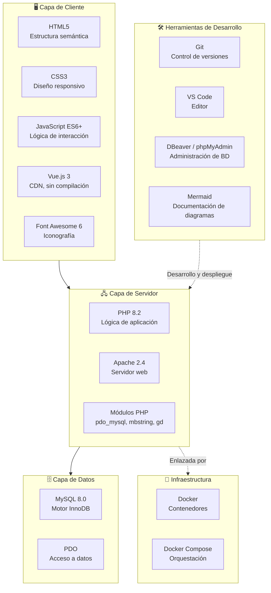
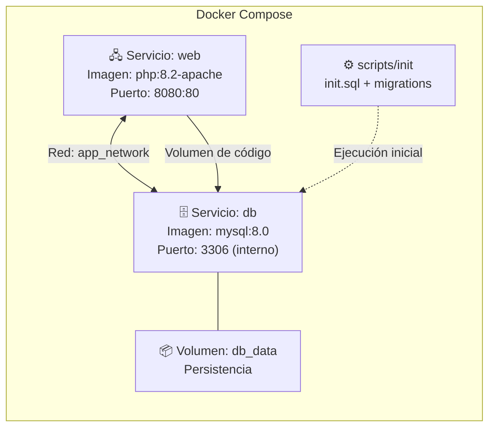

# Tecnologías Utilizadas
## Sistema de Tutorías y Modalidades de Grado

**Documento de Stack Tecnológico**
**Versión:*1.0**

---

## 1. Introducción

Este documento describe las tecnologías utilizadas en el desarrollo del Sistema de
Tutorías y Modalidades de Grado. La selección de cada tecnología responde a criterios
técnicos, restricciones del proyecto y bajo costo de licenciamiento.

---

## 2. Criterios de selección

| Criterio | Descripción |
|---|---|
| **Sin costo de licenciamiento** | Todas las tecnologías utilizadas son de código abierto. |
| **Restricciones del proyecto** | La solución debía desarrollarse sin frameworks PHP. |
| **Estabilidad** | Se priorizaron tecnologías consolidadas y ampliamente documentadas. |
| **Reproducibilidad** | El entorno debe poder reconstruirse de forma idéntica en cualquier equipo. |
| **Desempeño** | Se buscaron tecnologías con amplio soporte de la comunidad. |
| **Curva de aprendizaje** | Se favorecieron herramientas con documentación abundante en español e inglés. |

---

## 3. Stack tecnológico

---

## 4. Lenguajes de programación

### 4.1 PHP 8.2

| Aspecto | Detalle |
|---|---|
| **Versión** | 8.2 |
| **Tipado** | Dinámico con tipos opcionales |
| **Paradigma** | Orientado a objetos y procedural |
| **Rol en el sistema** | Toda la lógica de negocio y la generación de vistas. |
| **Extensiones requeridas** | `pdo_mysql`, `mbstring`, `gd`, `json` |

**Características del lenguaje que sustentan el diseño**

| Característica | Uso en el sistema |
|---|---|
| **Namespaces y `use`** | Organización de las clases de los módulos. |
| **Tipado estricto** | Contratos claros entre controladores y modelos. |
| **Expresiones de cierre** | Procesamiento funcional de colecciones. |
| **PDO nativo** | Acceso seguro y parametrizado a la base de datos. |
| **Extensión `password_*`** | Hash y verificación de contraseñas con bcrypt. |
| **CSPRNG** | Generación de tokens CSRF con `random_bytes()`. |
| **Enums** | Representación de estados controlados en el código. |
| **Constructor promotion** | Modelos y controladores con dependencias explícitas. |

**Ventajas para el proyecto**

- Lenguaje interpretado: despliegue directo sin compilación.
- Ecosistema amplio de documentación y comunidad.
- Cumplimiento de la restricción de no usar frameworks.

### 4.2 SQL

| Aspecto | Detalle |
|---|---|
| **Variante** | MySQL 8.0 |
| **Uso** | Definición del esquema, consultas de la aplicación y migraciones. |
| **Construcciones usadas** | `ENUM`, `UNIQUE` compuesto, claves foráneas, vistas, índices. |

### 4.3 JavaScript

| Aspecto | Detalle |
|---|---|
| **Versión** | ES6 o superior |
| **Uso** | Interacciones de la interfaz, validaciones en el cliente y peticiones AJAX. |
| **Paradigma** | Orientado a objetos y funcional. |

**Responsabilidades**

- Confirmación de acciones destructivas.
- Envío de formularios mediante `fetch()` sin recargar la página.
- Notificaciones dinámicas y contador de no leídas.
- Filtros dinámicos en las tablas del panel.

### 4.4 CSS3

| Aspecto | Detalle |
|---|---|
| **Uso** | Estilos de la interfaz, diseño responsivo y componentes visuales. |
| **Técnicas** | Flexbox, Grid, variables CSS, media queries, transiciones. |

**Sistema de diseño**

| Concepto | Implementación |
|---|---|
| **Variables CSS** | Colores institutionales, espaciados y tipografías centralizados. |
| **Diseño responsivo** | Puntos de corte para escritorio, tableta y móvil. |
| **Componentes** | Botones, tarjetas, tablas, modales, formularios y alertas. |
| **Modo accesible** | Contraste adecuado y estados de foco visibles. |

---

## 5. Base de datos

### 5.1 MySQL 8.0

| Característica | Configuración |
|---|---|
| **Versión** | 8.0 |
| **Motor de almacenamiento** | InnoDB |
| **Codificación** | `utf8mb4_unicode_ci` |
| **Integridad referencial** | Claves foráneas con `ON DELETE RESTRICT` y `ON UPDATE CASCADE`. |
| **Restricciones de dominio** | Campos `ENUM` para los estados controlados. |
| **Migraciones** | Archivos SQL versionados con control en `schema_migrations`. |

**Capacidades utilizadas**

| Capacidad | Aplicación |
|---|---|
| **Transacciones** | Operaciones compuestas de registros y estados. |
| **Índices** | Optimización de consultas por fecha, estado, tutor y estudiante. |
| **Claves compuestas** | Unicidad de combinaciones de negocio. |
| **Restricciones de rango** | `TINYINT` y `DECIMAL` para calificaciones y notas. |
| **Vistas** | Consultas agregadas de soporte al panel de indicadores. |

### 5.2 PDO

| Aspecto | Detalle |
|---|---|
| **Extensión** | `pdo_mysql` |
| **Modo de error** | `ERRMODE_EXCEPTION` |
| **Modo de obtención** | `FETCH_ASSOC` por defecto |
| **Emulación de prepares** | Desactivada |

---

## 6. librerías y frameworks del cliente

### 6.1 Vue.js 3

| Aspecto | Detalle |
|---|---|
| **Versión** | 3.x |
| **Distribución** | CDN, sin proceso de compilación |
| **Uso** | Interactividad de la interfaz y actualización reactiva del DOM. |
| **Dependencias** | Ninguna en el lado del servidor. |

**Justificación de su uso por CDN**

- Evita un proceso de compilación en el despliegue.
- Reduce la complejidad de la cadena de herramientas.
- Permite mantener la trazabilidad total del código servido.

**Comportamiento reactivo utilizado**

| Característica | Aplicación |
|---|---|
| **Reactividad** | Actualización automática de la interfaz ante cambios de estado. |
| **Directivas** | `v-if`, `v-for`, `v-model` para mostrar, listar y enlazar datos. |
| **Propiedades calculadas** | Valores derivados para el filtrado de tablas. |
| **Gestores de eventos** | Respuesta a clics y envíos de formularios. |

### 6.2 Font Awesome 6

| Aspecto | Detalle |
|---|---|
| **Tipo** | Biblioteca de iconos |
| **Uso** | Iconografía de la interfaz |
| **Licencia** | Libre para uso académico |

### 6.3 Bibliotecas no utilizadas

| Biblioteca | Motivo de no uso |
|---|---|
| **Laravel** | Restricción del proyecto: sin frameworks PHP. |
| **Symfony** | Restricción del proyecto: sin frameworks PHP. |
| **jQuery** | Vue.js cubre la interactividad requerida de forma más limpia. |
| **Bootstrap** | Se desarrolló una hoja de estilos propia coherente con la identidad institucional. |
| **Axios** | La API `fetch()` nativa es suficiente para el volumen de peticiones del sistema. |

---

## 7. Servidor web

### 7.1 Apache 2.4

| Aspecto | Detalle |
|---|---|
| **Función** | Servidor web y ejecución de PHP. |
| **Módulos** | `mod_rewrite` para URLs limpias, `mod_headers` para cabeceras de seguridad. |
| **Document root** | Directorio `public/` del proyecto. |

**Configuración aplicada**

| Directiva | Propósito |
|---|---|
| `AllowOverride All` | Permite la configuración por `.htaccess`. |
| `mod_rewrite` | Reescribe las URL hacia el front controller. |
| `DirectoryIndex` | Define `index.php` como índice de directorio. |
| `Options -Indexes` | Impide el listado de directorios. |

---

## 8. Contenedores y despliegue

### 8.1 Docker

| Aspecto | Detalle |
|---|---|
| **Función** | Aísla y empaqueta el entorno de ejecución. |
| **Ventaja** | Garantiza que el sistema funcione igual en cualquier equipo. |

### 8.2 Docker Compose

| Servicio | Imagen | Función |
|---|---|---|
| `web` | `php:8.2-apache` | Servidor web con el código de la aplicación. |
| `db` | `mysql:8.0` | Motor de base de datos con volumen persistente. |

**Características del despliegue**

| Característica | Detalle |
|---|---|
| **Reproducibilidad** | `docker compose up` levanta el sistema completo. |
| **Aislamiento de red** | La base de datos no se expone fuera de la red de contenedores. |
| **Persistencia** | El volumen conserva los datos entre reinicios. |
| **Inicialización automática** | El esquema y los datos iniciales se cargan al crear el contenedor. |
| **Migraciones** | Los archivos versionados se aplican de forma controlada y auditable. |

### 8.3 Dockerfile

| Aspecto | Detalle |
|---|---|
| **Base** | Imagen oficial `php:8.2-apache`. |
| **Extensiones** | `pdo_mysql`, `mbstring`, `gd`. |
| **Document root** | Configurado en `public/`. |
| **Permisos** | Asignados al usuario del servidor web. |

---

## 9. Configuración

### 9.1 Variables de entorno

| Variable | Tipo | Descripción |
|---|---|---|
| `DB_HOST` | Texto | Servidor de la base de datos. |
| `DB_PORT` | Texto | Puerto de conexión. |
| `DB_NAME` | Texto | Nombre del esquema. |
| `DB_USER` | Texto | Usuario de conexión. |
| `DB_PASS` | Texto | Contraseña de conexión. |
| `APP_DEBUG` | Booleano | Muestra el detalle de los errores. |
| `DB_PERSISTENT` | Booleano | Habilita conexiones persistentes. |

### 9.2 Archivo `.env`

El archivo de entorno separa la configuración sensible del código fuente. No se
versiona en el repositorio y se ajusta a los valores específicos de cada instalación.

---

## 10. Herramientas de desarrollo

| Herramienta | Uso |
|---|---|
| **Visual Studio Code** | Editor de código con extensiones para PHP y Mermaid. |
| **Git** | Control de versiones y trazabilidad de cambios. |
| **Docker Desktop** | Ejecución de los servicios en Windows y macOS. |
| **phpMyAdmin / DBeaver** | Inspección y administración de la base de datos. |
| **Mermaid** | Generación de los diagramas de la documentación. |
| **Postman / curl** | Pruebas de los endpoints AJAX. |

---

## 11. Versionado del esquema

### 11.1 Esquema de migraciones

```mermaid
graph LR
    I["init.sql<br/>Esquema base"] --> M1["001_baseline_actual"]
    M1 --> M2["002_notificaciones"]
    M2 --> M3["003_periodos"]
    M3 --> M9["009_roles_mg_catalogo"]
    M9 --> M10["010_declaraciones_modalidad"]
    M10 --> M11["011_avales_jurados"]
    M11 --> M12["012_actas_calificacion"]
    M12 --> M13["013_avales_archivos_acta"]
    M13 --> M14["014_parametros_mg"]
    M14 --> M15["015_cohortes_calendario"]
    M15 --> M16["016_mg_sprint3"]
    M16 --> M17["017_nivel_academico_tutorias"]
    M17 --> REG[("schema_migrations<br/>Versiones aplicadas")]
```

### 11.2 Principios de las migraciones

| Principio | Aplicación |
|---|---|
| **Versionado numérico** | Cada archivo tiene un número único y correlativo. |
| **Registro de aplicación** | `schema_migrations` conserva las versiones ya aplicadas. |
| **Idempotencia** | La re-ejecución no produce efectos adversos. |
| **Correlatividad** | Los cambios de esquema quedan trazados en el repositorio. |

---

## 12. Justificación de la ausencia de frameworks

| Aspecto | Justificación |
|---|---|
| **Requisito académico** | El proyecto exige demostrar el conocimiento de los fundamentos del desarrollo web en PHP. |
| **Control total** | La arquitectura, el enrutamiento y la capa de datos se implementan de forma explícita. |
| **Sin dependencia de terceros** | El sistema no hereda vulnerabilidades conocidas de un framework. |
| **Aprendizaje** | Permite comprender el ciclo completo de una petición HTTP. |

---

## 13. Resumen de tecnologías

| Categoría | Tecnología | Versión |
|---|---|---|
| **Lenguaje del servidor** | PHP | 8.2 |
| **Servidor web** | Apache | 2.4 |
| **Base de datos** | MySQL | 8.0 |
| **Acceso a datos** | PDO | Extensión nativa de PHP |
| **Estructuración** | HTML5 | — |
| **Estilos** | CSS3 | — |
| **Lógica del cliente** | JavaScript | ES6+ |
| **Framework del cliente** | Vue.js | 3.x (CDN) |
| **Iconos** | Font Awesome | 6.x |
| **Contenedores** | Docker | — |
| **Orquestación** | Docker Compose | — |
| **Versionado del código** | Git | — |
| **Documentación de diagramas** | Mermaid | — |

---

*Fin del documento de Tecnologías*
