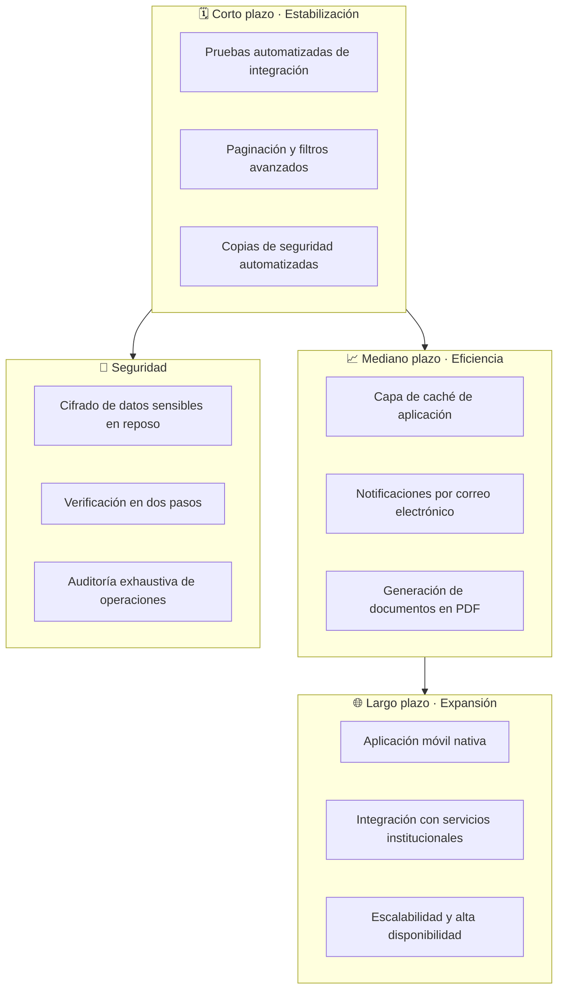

# Trabajo Futuro
## Sistema de Tutorías y Modalidades de Grado

**Documento de Trabajo Futuro**
**Versión:** 1.0

---

## 1. Introducción

Este documento presenta las líneas de trabajo futuro que se consideran relevantes para
la evolución del Sistema de Tutorías y Modalidades de Grado. Las propuestas se
organizan a partir de las **limitaciones** identificadas durante el desarrollo del
sistema, documentadas en [`Limitaciones.md`](Limitaciones.md).

El documento tiene un carácter estrictamente académico: describe de manera
anticipada las posibles líneas de evolución, sin comprometer el alcance del proyecto
actual ni constituir compromisos de implementación.

---

## 2. Enfoque general

---

## 3. Trabajo futuro por categoría

### 3.1 Pruebas y calidad

| # | Línea de trabajo | Justificación |
|---|---|---|
| 1 | **Suite de pruebas automatizadas de integración** | Verificar de forma continua el flujo controlador → modelo → base de datos. |
| 2 | **Pruebas de regresión sobre el módulo MG** | El módulo de modalidades de grado concentra la mayor cantidad de estados y transiciones. |
| 3 | **Pruebas de carga concurrentes** | Medir el comportamiento del sistema con múltiples usuarios simultáneos. |
| 4 | **Informe automático de cobertura** | Identificar las rutas de código que no se ejercitan en las pruebas. |

### 3.2 Usabilidad e interfaz

| # | Línea de trabajo | Justificación |
|---|---|---|
| 5 | **Paginación en todas las tablas** | Mejorar la navegación cuando el volumen de registros crezca. |
| 6 | **Filtros avanzados y guardados** | Cada rol consulta información según criterios propios y repetidos. |
| 7 | **Calendario visual de tutorías** | Facilitar la visualización de la agenda de cada participante. |
| 8 | **Exportación de datos a formatos abiertos** | Permitir el análisis de la información fuera del sistema. |

### 3.3 Notificaciones y comunicación

| # | Línea de trabajo | Justificación |
|---|---|---|
| 9 | **Notificaciones por correo electrónico** | El usuario conocería los cambios de estado sin ingresar al sistema. |
| 10 | **Recordatorios automáticos de tutoría** | Avisar antes de la fecha y hora de la sesión. |
| 11 | **Integración con calendario externo** | Sincronizar las sesiones con la agenda personal de los participantes. |
| 12 | **Mensajería interna entre actores** | Facilitar la comunicación sobre el estado de los procesos. |

### 3.4 Gestión documental

| # | Línea de trabajo | Justificación |
|---|---|---|
| 13 | **Generación automática de PDF** | Entregar documentos en formato listo para impresión y archivo. |
| 14 | **Firma electrónica de las actas** | Otorgar valor probatorio al acta de defensa. |
| 15 | **Repositorio central de documentos** | Evitar la eliminación de archivos y conservar el historial documental. |
| 16 | **Versionado visual de plantillas** | Facilitar la edición de las plantillas por parte del coordinador. |

### 3.5 Seguridad

| # | Línea de trabajo | Justificación |
|---|---|---|
| 17 | **Cifrado de datos sensibles en reposo** | Reforzar la confidencialidad de la información de los estudiantes. |
| 18 | **Verificación en dos pasos** | Añadir un segundo factor de autenticación para los roles administrativos. |
| 19 | **Auditoría exhaustiva de operaciones** | Registrar también las operaciones de escritura y los accesos a datos. |
| 20 | **Política de contraseñas robustas** | Exigir contraseñas que cumplan criterios de complejidad. |
| 21 | **Vencimiento por inactividad de la sesión** | Limitar la ventana de exposición de una sesión abierta. |
| 22 | **Protección HTTPS obligatoria** | Garantizar la confidencialidad de los datos en tránsito. |
| 23 | **Restablecimiento seguro de contraseñas** | Incorporar tokens de un solo uso con vigencia limitada. |

### 3.6 Rendimiento y escalabilidad

| # | Línea de trabajo | Justificación |
|---|---|---|
| 24 | **Capa de caché de aplicación** | Reducir la carga de las consultas agregadas del panel de indicadores. |
| 25 | **Optimización de índices por análisis de consultas** | Ajustar los índices a partir de la evidencia de uso real. |
| 26 | **Procesamiento asíncrono de importaciones** | Evitar el bloqueo de la interfaz durante la carga de padrones extensos. |
| 27 | **Particionado de tablas transaccionales** | Mantener el desempeño con volúmenes crecientes de datos. |
| 28 | **Réplica de lectura para reportes** | Desacoplar las consultas analíticas de la operación principal. |

### 3.7 Integración institucional

| # | Línea de trabajo | Justificación |
|---|---|---|
| 29 | **Servicio web de matrícula** | Evitar la duplicación de datos de estudiantes y materias. |
| 30 | **Sincronización de carreras y planes de estudio** | Mantener el catálogo institucional actualizado. |
| 31 | **Interoperabilidad con el sistema de grados** | Articular el resultado de las defensas con el registro académico. |
| 32 | **Directorio institucional único** | Evitar el mantenimiento de múltiples listas de usuarios. |

### 3.8 Experiencia institucional y ampliación

| # | Línea de trabajo | Justificación |
|---|---|---|
| 33 | **Aplicación móvil nativa** | Facilitar el acceso de estudiantes y tutores desde dispositivos móviles. |
| 34 | **Modo sin conexión para consultas** | Permitir la consulta de la agenda sin conectividad de red. |
| 35 | **Panel de analítica institucional** | Ofrecer indicadores estratégicos a la dirección de la institución. |

### 3.9 Arquitectura

| # | Línea de trabajo | Justificación |
|---|---|---|
| 36 | **Automatización del despliegue continuo** | Reducir el riesgo de errores en las publicaciones de nuevas versiones. |
| 37 | **Entornos separados por etapa** | Separar los entornos de desarrollo, pruebas y producción. |
| 38 | **Monitoreo y registro centralizado** | Detectar incidentes de disponibilidad de forma proactive. |
| 39 | **Documentación de la API interna** | Facilitar el mantenimiento de los endpoints AJAX. |
| 40 | **Refactor gradual de la capa de datos** | Evaluar la introducción de un ORM sin comprometer la estabilidad actual. |

---

## 4. Trabajo futuro por horizonte de implementación

| Horizonte | Líneas | Justificación |
|---|---|---|
| **Corto plazo** | 1, 2, 3, 5, 6, 17, 20, 22 | Accesibilidad institucional, seguridad básica y control del crecimiento de la información. |
| **Mediano plazo** | 9, 10, 11, 13, 18, 24, 25, 26, 27, 29, 30, 33 | Eficiencia operativa y comunicación efectiva. |
| **Largo plazo** | 7, 12, 14, 15, 16, 19, 21, 23, 28, 31, 32, 34, 35, 36, 37, 38, 39, 40 | Expansión funcional, integración institucional y maduración de la plataforma. |

---

## 5. Priorización de las propuestas

| Prioridad | Criterio | Líneas cubiertas |
|---|---|---|
| **Alta** | Afectan la seguridad o la operación cotidiana | 17, 20, 22, 5, 6, 9, 13 |
| **Media** | Mejoran la eficiencia y la experiencia de uso | 1, 3, 10, 24, 25, 26, 29 |
| **Baja** | Amplían el alcance del sistema | 12, 14, 33, 35, 40 |

---

## 6. Conclusiones del trabajo futuro

El Sistema de Tutorías y Modalidades de Grado constituye una base sólida sobre la
cual construir una plataforma de gestión institucional más completa. Las líneas de
trabajo futuro propuestas se organizan en torno a cuatro ejes: la calidad de las
pruebas, la eficiencia de la operación, la ampliación funcional y el refuerzo de la
seguridad.

La mayoría de las propuestas se apoya en funcionalidades ya existentes en el modelo
de datos y en la arquitectura actual, lo que reduce el esfuerzo de integración. Las
líneas de mayor impacto a corto plazo son la aplicación de la paginación, el
refuerzo del cifrado en reposo y la habilitación de notificaciones por correo, todas
ellas con efecto directo sobre la experiencia del usuario y la protección de la
información.

El documento no constituye una hoja de ruta comprometida, sino una anticipación
académica de la evolución posible del sistema, coherente con las limitaciones
identificadas y con las necesidades previsibles de una institución en crecimiento.

---

*Fin del documento de Trabajo Futuro*
